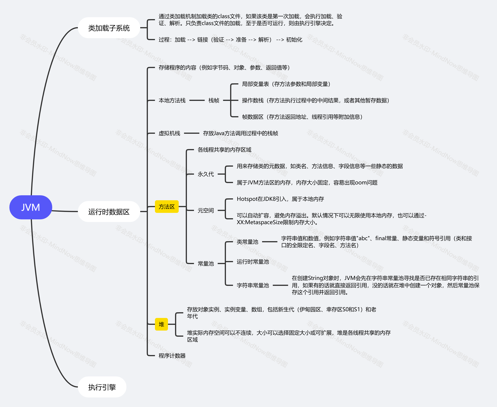
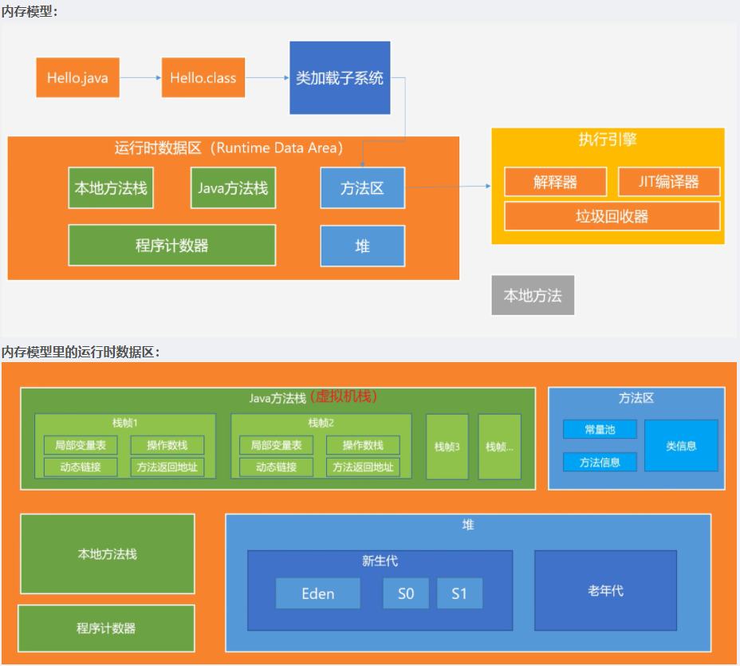
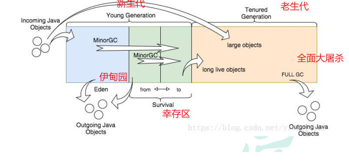
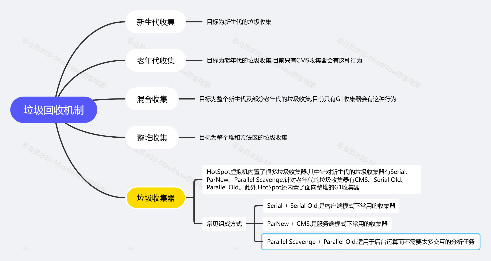

# JVM相关知识-个人梳理
## (一)JVM内存模型:

## (二)JVM中的GC流程:

1. 任何新对象都分配到 eden 空间。两个幸存者空间开始时都是空的。
2. 当 eden 空间填满时，将触发一个Minor GC(年轻代的垃圾回收，也称为Young GC)，删除所有未引用的对象，大对象（需要大量连续内存空间的Java对象，如那种很长的字符串）直接进入老年代。
3. 所有被引用的对象作为存活对象，将移动到第一个幸存者空间S0，并标记年龄为1，即经历过一次Minor GC。之后每经过一次Minor GC，年龄+1。GC分代年龄存储在对象头的Mark Word里。
4. 当 eden 空间再次被填满时，会执行第二次Minor GC，将Eden和S0区中所有垃圾对象清除，并将存活对象复制到S1并年龄加1，此时S0变为空。
5. 如此反复在S0和S1之间切换几次之后，还存活的年龄等于15的对象（JDK8默认15，JDK9默认7，-XX:InitialTenuringThreshold=7）在下一次Minor GC时将放到老年代中。
6. 当老年代满了时会触发Major GC（也称为Full GC），Major GC 清理整个堆 – 包括年轻代和老年代。

## (三)JVM的垃圾回收机制:

