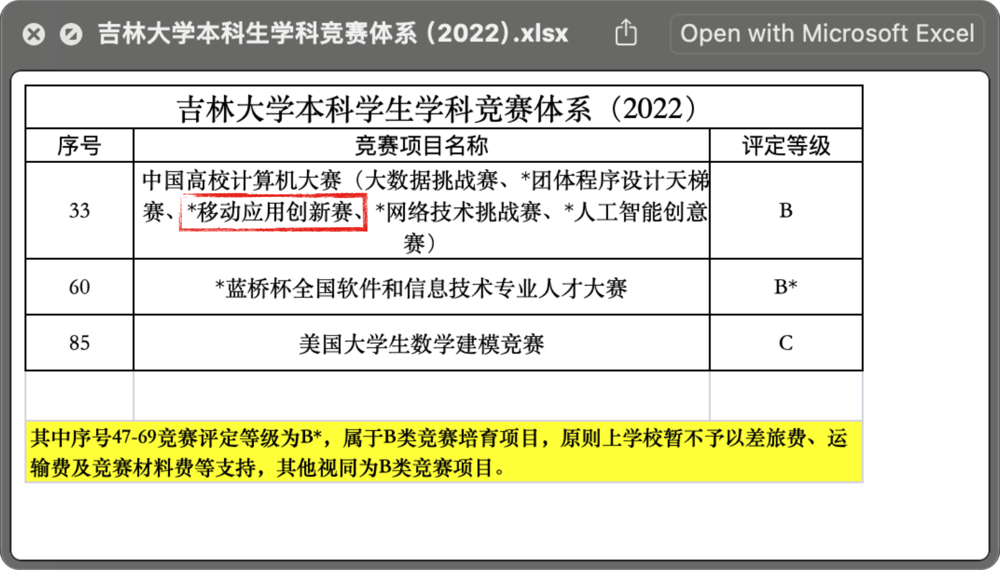
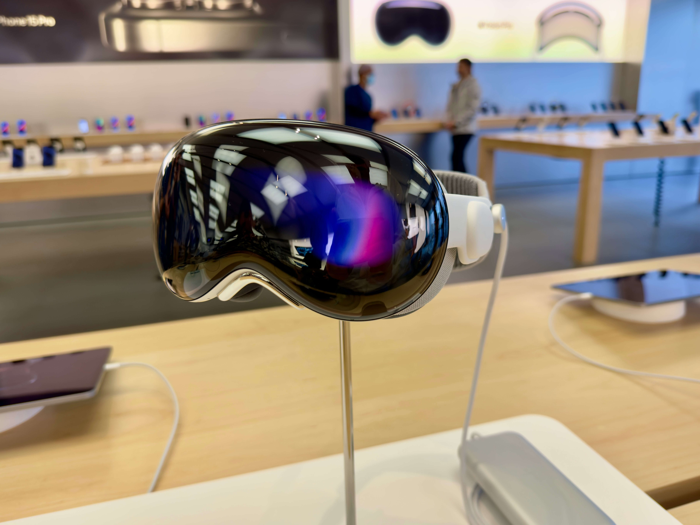

# 移动应用创新赛宣讲会暨 Vision Pro 体验会 <Badge type="tip" text="ARCHIVED" />

:::danger 注意
我们在校园网之窗投放的活动推广中，活动日期填写有误，请以官网时间为准。给您造成困扰，敬请谅解！

_（本次活动已结束，敬请期待我们的下次活动～）_
::: 

> 🗓️ 日期：2024年04月**06日-07日**
>
> 🕑 **6日场** 时间：14:00-17:00
>
> 🕕 **7日场** 时间：18:00-21:00
>
> 🏢 地点：南区计算机楼 B110苹果机房
>
> 👩🏻‍💻 主讲人：相开原 张天翼 陈悦华
>
> ✋ 报名方式：请阅读本篇活动说明，申请表在页面底部

## 活动概述

_一年一度的**移动应用创新赛**就要来啦，错过再等一年！什么？这次还有**Vision Pro**？！_

为了更好地宣传竞赛，并鼓励大家积极参赛，[吉林大学Doers&Dreamers iOS Club](/about-us/)（简称JLU iOS Club）将在全校范围内组织一场公益宣讲活动，帮助同学们更好地了解并参与到移动应用创新赛中。

恰逢近日我社与[安诺希Apple校园体验中心](/news/an-nuo-xi/)初步建立合作关系，他们将在竞赛、活动等多方面为我社提供支持。对于本次竞赛，安诺希方面将连同Apple官方，为一些有需要的参赛同学**提供设备支持**，如MacBook Pro/iPad等。同时，安诺希还为我社成员提供了**Vision Pro的借用权**，可供参赛同学开发AR赛道App使用。

JLU iOS Club核心社员们在试用了Vision Pro之后，对其震撼的画质表现、交互体验赞不绝口，也非常能让更多的人能体验到。因此，我们希望为每一位有志于畅想App未来的前行者，**免费分享Vision Pro的体验机会**，一同感受那种 “看见未来” 的美妙。

综上所属，我们此次活动将分为两个部分，首先是是针对移动应用创新赛的宣讲会，之后的剩余时间我们会安排符合要求的同学依次体验Vision Pro。

## 什么是：移动应用创新赛（MAIC）

这是一场以 iOS/PadOS 系统设计开发移动应用程序的高端竞赛。学生组成一个两到三人的队伍，在创新创意赛道上提交自己的原创 App 原型，在决赛时最终实现并完善。参赛者可自由命题，鼓励参赛队伍使用Swift语言进行开发。无论你是代码高手还是才华横溢的设计师，甚至**零编程基础**，都可在这里一展身手。

::: tip 我真的有能力参赛吗？
是的，你没有听错，**不会编程也能参赛！**

对于MAIC的初赛而言，只要求参赛者提交一个项目说明文档，也就是**一个PPT**，完全不要求提交任何代码，只要你的点子够好！

进入复赛后，您可以再另外找1～2人组队，我们也可以在社团内为您招募擅长编程的同学一同参赛。

---

对于**擅长编程**的同学，您也可以找到擅长设计/美工的同学组队。Apple的Swift语言与SwiftUI框架也十分简单易学，只需一日即可上手，数周即可熟练掌握！

但是，我没有Mac没办法用Xcode怎么办？

别担心，一方面iPad版**Swift Playground**已经能够独当一面，多数SwiftUI开发场景都不在话下；另一方面社团也可以为优秀的参赛团队提供**必要的Apple设备**。
:::

获奖作品将获得丰厚奖励，甚至有机会与苹果公司CEO面对面交流。更重要的是，参赛过程将激发学生们的创新思，培养解决实际问题的能力，为未来发展打下坚实基础。这场赛事犹如一面广阔的舞台，等待着热爱科技、怀揣梦想的你来施展才华风采！

最重要的是，MAIC自2022年起，被列入**吉林大学B*类竞赛**，获奖同学享有**加分和推免**等政策！

## 如何获得 Vision Pro 体验资格

### 途径一：在线上报名表中提交您的App想法

请尽量参照MAIC的[作品主题要求](/competitions/maic/#%E4%BD%9C%E5%93%81%E4%B8%BB%E9%A2%98%E8%A6%81%E6%B1%82)，在报名表中简要描述一个**新手机App的想法**（不一定是AR相关应用），其中至少包括以下几点：

1. App 的主要实现的**功能**？
2. 试图解决什么样的**用户痛点/社会问题**？
3. 市面上是否已经有其它**类似的产品**了？

报名表可以 1～2 人共同提交，请依次注明姓名与专业，均可获得约15～20分钟的体验资格。

因体验人数较多，现场时间有限，每场活动我们至少会安排至少5～6人体验。因此，根据提交时间/质量等，我们可能会筛选掉部分申请，或安排到稍晚的体验场次，并通过您留下的联系方式通知，望您谅解！

### 途径二：参与我们的线下宣讲会

如果您暂时没想到什么好点子，也可以将报名表App想法一栏留空，**先来宣讲会听听看**！我们会手把手带你了解MAIC竞赛的全流程。之后如果您和其他同学组队，或是有好的想法希望与我们分享，可以在竞赛群内私聊群主，我们之后也会为您安排上！如果现场条件允许，我们也会给表现积极的同学一个机会哟！

::: warning 注意
因为Vision Pro不适合佩戴框架眼镜使用，建议体验者**近视度数在300度以下**，或**佩戴隐形眼镜**。我们也在尝试定制300度及更高度数的镜片，预计月中可以收到。如果您不满足视力要求，我们也可以在本场活动后单独为您安排体验时间。
:::

## 活动流程

## 报名方式

即将离开本站，前往腾讯文档填写活动报名表……

<el-button type="primary" @click="outerVisible = true" size="large" round>
  🎉 点击报名
</el-button>
<el-button type="info" size="large" round>
  <a href="/competitions/maic/">👉 了解更多竞赛信息</a>
</el-button>

<el-dialog v-model="outerVisible" title="请确认……" width="80%">
  您是否已完整阅读本次活动说明，并了解提交App想法的要求？
  <el-dialog
    v-model="innerVisible"
    title="请选择您要报名的场次"
    append-to-body
    width="80%"
  >
    
4月6日场：14:00-17:00

    
4月7日场：18:00-21:00

    <template #footer>
      

        <el-button type="primary">
          <a href="https://docs.qq.com/form/page/DTFVvQWlxRlN2eFhL" target="_blank">4月6日场</a>
        </el-button>
        <el-button type="primary">
          <a href="https://docs.qq.com/form/page/DTHdnRVN1b0J4cG54" target="_blank">4月7日场</a>
        </el-button>
      

    </template>
  </el-dialog>
  <template #footer>
    

      <el-button @click="outerVisible = false">我再看看</el-button>
      <el-button type="primary" @click="innerVisible = true">
        开始报名
      </el-button>
    

  </template>
</el-dialog>

### 🔥 加入2024-MAIC竞赛群

