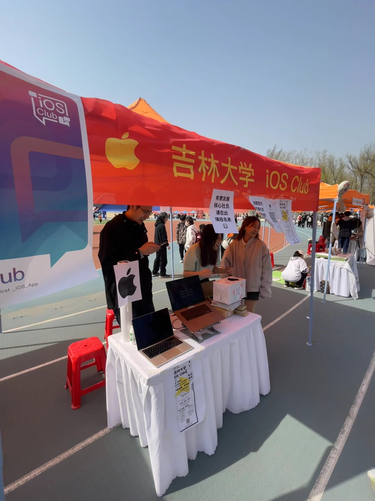
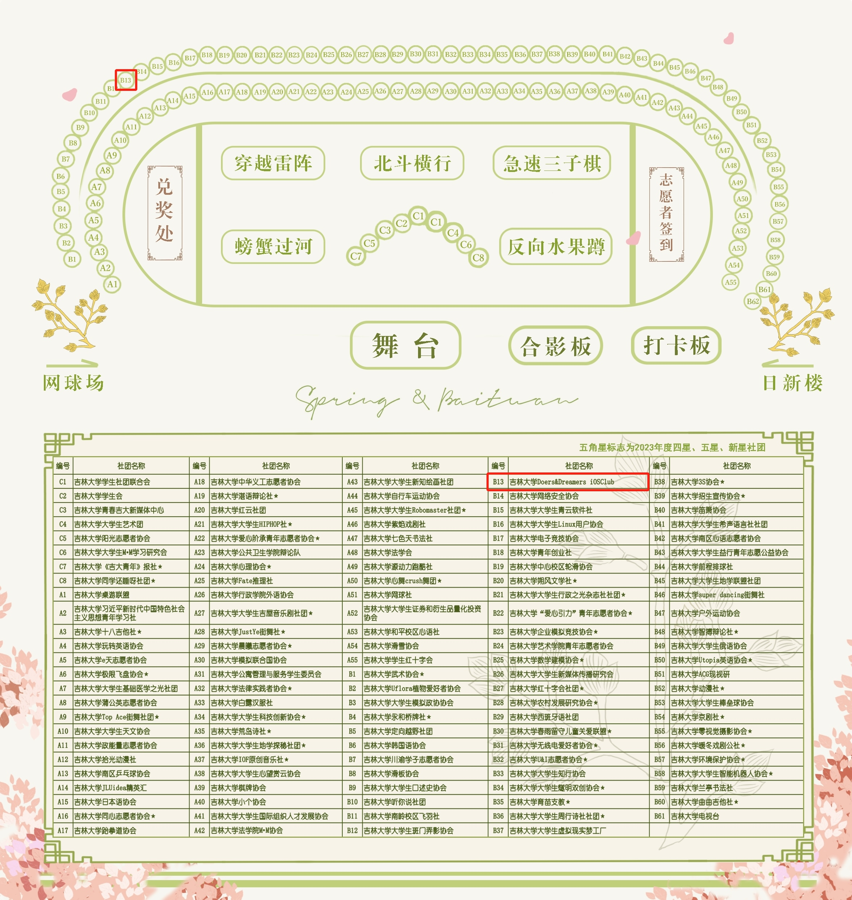

# 😲 果粉们看过来！JLU iOS Club 纳新啦！

> 笔落于此 或许有些言不达意 
> 
> 但我们有着同一个梦想 
> 
> 热爱同一个远方
> 
> 加入 JLU iOS Club
> 
> **我们在这等你！**

## 关于我们

吉林大学 Doers & Dreamers iOS Club，简称 JLU iOS Club，是一个由 Apple 公司资助和指导，于2017年成立的计科学院直属社团。成员涵盖计算机学院、软件学院、艺术学院、文学院等，**只要有爱，我们都欢迎！**

Club 定期举办各类技术分享会，帮助开发者提升技术水平，并不定期面向果粉们分享 Apple 产品使用技巧，鼓励大家体验融入 Apple 生态。同时每年会有两次面向全校的公开活动，为[两场比赛](/competitions/index)做宣讲，帮助大家更好地参与竞赛。

## 加入我们，福利多多

JLU iOS Club 原则上设有社长兼负责人 1 名，副社长 2~3 名，并可兼任其中一部门的部长。

社团下设3个部门，分别为**技术支持部**、**策划行动部**、**新媒体中心**，与社长共同组成社团管理层，完成社团内外的各项事务。管理层成员连同参赛同学，均为我社**核心成员**，享有更多的关注与资源支持。

非核心社员分为普通社员与正式社员。普通社员实为编外人员，可以加入社团相关联络组织，获取最新活动咨询、学习资料等，也可以参与社团面向全校的公开活动，但社团方面仅提供最有限的支持，也不能参与任何社团内部活动。正式社员在普通社员的基础上享有更多权益，包括但不限于以下几点：

- 正式社员专有身份证明，每次活动可参与集章，获得特殊奖励；
- 可以参与社团内部的小规模活动，如技术分享会、星光露营、外出团建等；
- 可以获得每年一次的《Swift 应用程序开发 助理级认证》考试资格；
- 与[安诺希校园体验中心](https://www.jluios.club/news/an-nuo-xi/)合作，为社员购买苹果产品提供专享优惠与售后；
- 根据竞赛及其它需求，可酌情提供 Apple 设备借用权；
- 可以参与社团领导层选拔，出席投票选举与换届仪式。

其余各部门职能，以及社团架构示意图，可点击下方链接查看：

<el-button
type="primary"
size="large"
@click="router.go('/join-us/#%E7%BB%84%E7%BB%87%E6%9E%B6%E6%9E%84')"
style="display: block;width: 12rem;margin: 0 auto;"
round
>
🔗 了解社员组织结构
</el-button>

## 来找我们玩！

4月14日，早上八点半到下午四点半，来田径场**B13**摊位找到 **吉林大学 Doers&Dreamers iOS Club 社团**，我们期待与您相见！

来摊位参与我们的**趣味知识问答活动**，赢取限量精美 iOS Club 周边！先到先得！还有机会获得 Vision Pro 体验资格！

- 参与问答，即可获得定制 Club 贴纸！
- 答对 3 题以上，可在 Club 定制**钥匙扣、马克笔、便利贴**中任选其一！
- 答对 5 题以上，可获得 _**Vision Pro**_ 体验资格！
- 经过我们的认证，即有资格加入 Club ，可在 Club 定制**T恤、马克杯、帽子**中任选其一！

::: tip
我们可能会根据参与人数、奖品发放情况等，实时轻微调整周边发放规则，请以现场安排为准，感谢理解！

_（不过私以为我们的周边奖品储备已经相当饱和了🤔）_
:::

## 关注我们

<dualQRCode/>

> _和有梦想的人一起，改变世界。_
> 
> **JLU iOS Club** 与您不见不散！

