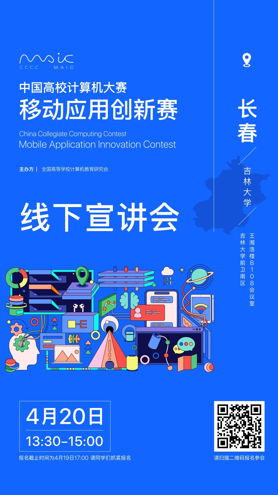
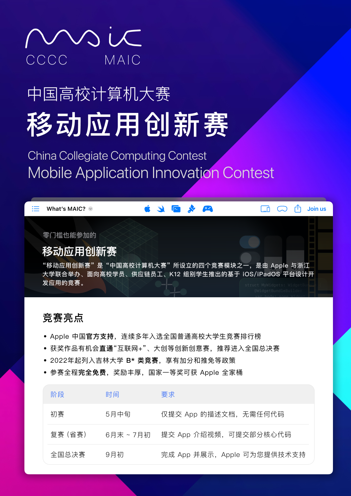
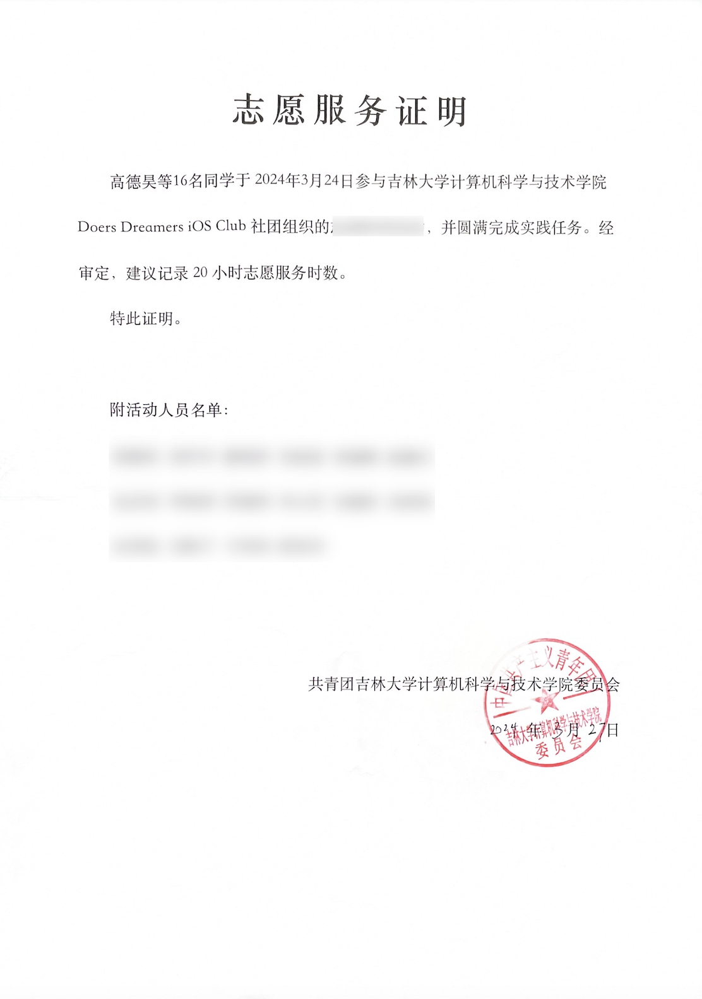

# 移动应用创新赛——官方宣讲会来啦！

> 🗓️ 日期：2024年**04月20日**
>
> 🕜 时间：下午 13:30-15:00
>
> 🏢 地点：南区计算机楼 B108 会议室
>
> 👩🏻‍💻 主讲人：上海交通大学-董占勋
>           MAIC 组委会秘书-曹颖萍
> 
> ✋ 参与报名：[报名链接](https://www.wjx.cn/vm/tUo0G8e.aspx)
> 
> ❗️ 报名截止时间：4月19日 17:00，请同学们抓紧报名

## 活动概述

“移动应用创新赛”是 “中国高校计算机大赛” 所设立的四个竞赛模块之一，是由 Apple 与浙江大学联合举办、面向高校学员、供应链员工、K12 组别学生推出的基于 iOS/iPadOS 平台设计开发应用的竞赛。

为了更好地组织推广移动应用创新赛，官方组委会在长春安排了一场宣讲会，选址在吉林大学前卫南区。此次宣讲会为官方性质，会带来**更多作品案例**分享，组委会老师也会在现场为大家答疑。

本次宣讲会由**上海交通大学董占勋老师**，和**移动应用创新赛组委会秘书曹颖萍老师**作为主讲嘉宾，JLU iOS Club 作为协办团队共同主持。

## 竞赛亮点

- **Apple 中国官方支持**，连续多年入选全国普通高校大学生竞赛排行榜
- 获奖作品有机会直通“互联网+”、大创等创新创意赛，推荐进入**全国总决赛**
- 2022年起列入吉林大学 **B* 类竞赛**，享有加分和推免等政策
- 参赛全程**完全免费**，奖励丰厚，国家一等奖可获 **Apple 全家桶**

<el-button
type="primary"
size="large"
@click="router.go('/competitions/maic/')"
style="display: block;width: 12rem;margin: 0 auto;"
round
>
🔗 了解更多竞赛信息
</el-button>

## 活动奖励

1. 组委会会为参与宣讲会活动的同学发放小礼品
2. 现场参与互动答疑的同学可额外获得礼品！
3. 学院会为到场同学开取约 30 小时的志愿时长证明

## 活动流程

<el-timeline style="max-width: 600px">
  <el-timeline-item
    v-for="(step, index) in steps"
    :key="index"
    :timestamp="step.time"
    type="primary"
  >
    {{ step.name }}
      主讲人：{{ step.people }}
  </el-timeline-item>
</el-timeline>

## 🔥 加入2024-MAIC竞赛群

## 关注 JLU iOS Club

<dualQRCode/>

