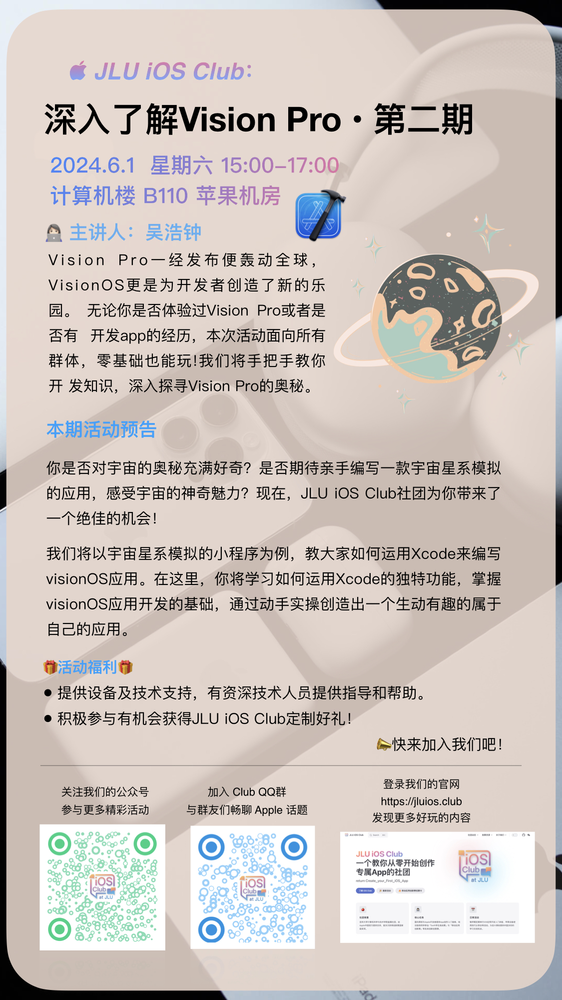
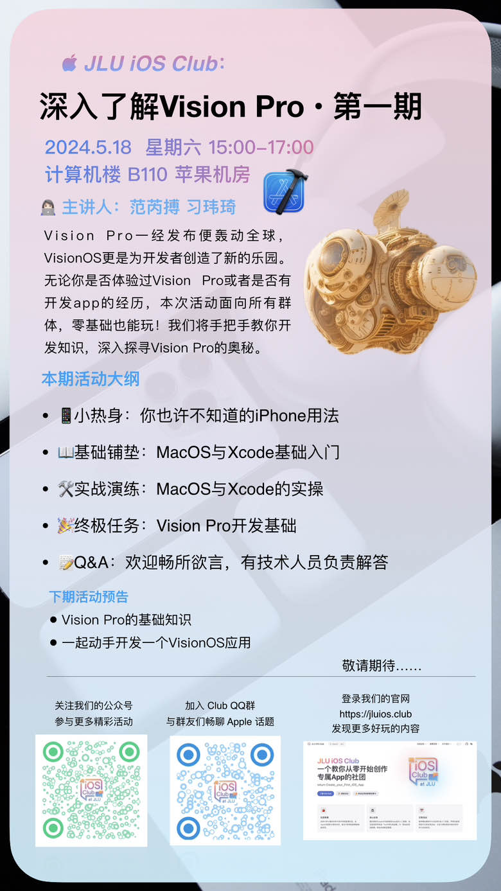
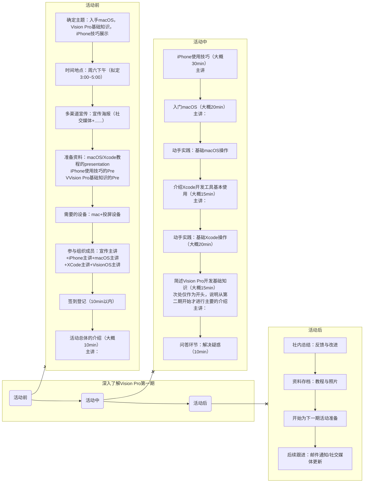

# 《深入了解 Vision Pro》系列活动 <Badge type="info" text="第一期" />

> 🚀 深入探索Apple Vision Pro，掌握Xcode编程，一起开启visionOS应用之旅！🚀

亲爱的同学们，

你是否对 Apple Vision Pro 的神秘面纱充满好奇？是否渴望掌握 Xcode 开发工具，亲手编写出**属于自己的 VisionOS 空间应用**？那么，这个机会你绝对不能错过！

📣 吉林大学 Doers&Dreamers iOS Club（简称JLU iOS Club）将在全校范围内组织举办《深入了解Vision Pro》系列活动，开展2～3期别开生面的学习实践！

## 📅 活动时间地点：

### 第二期活动 <Badge type="tip" text="NEW" />

[🔗点击前往第二期活动详情](/activities/240601-learn-xcode-and-vision-pro/)

- 📅 时间： 2024年6月1日（周六）15:00~17:00
- 📍 地点： 前卫南区计算机楼 B110 苹果机房

第一期活动

- 📅 时间： 2024年5月18日（周六）15:00~17:00
- 📍 地点： 前卫南区计算机楼 B110 苹果机房

## 🌟 活动亮点：

1. Apple Vision Pro 深度解析：我们将带你领略 Apple Vision Pro 的前沿科技，从外观设计到硬件配置，再到功能特性，让你全面了解这款革命性的设备。
2. Xcode开发工具入门：你是否对 Xcode 感到陌生？不用担心，我们将从零开始，教你如何安装、配置 Xcode ，并带你编写出第一个 iOS 应用。
3. VisionOS 应用实践：我们将深入探索 VisionOS，教你如何为 Apple Vision Pro 编写专属应用。通过实践操作，你将有机会将自己的创意转化为现实。

## 🎁 活动福利：

* 现场提供设备支持，并将有资深技术人员亲自指导，解答你的疑惑。
* 活动中有机会体验到 Vision Pro，并获得 JLU iOS Club 定制好礼！

## ⚙️ 活动流程

## 📣 报名方式：

填写[在线报名表](https://docs.qq.com/form/page/DTFhVQ3FWeklHeVV5)即可轻松报名！名额有限，先到先得！

## 💪 行动起来！

让我们一起深入探索 Apple Vision Pro 的奥秘，掌握 Xcode 开发工具，开启 VisionOS 应用之旅！这不仅是一次学习的机会，更是一次挑战自我、展现才华的舞台。我们期待你的加入！
