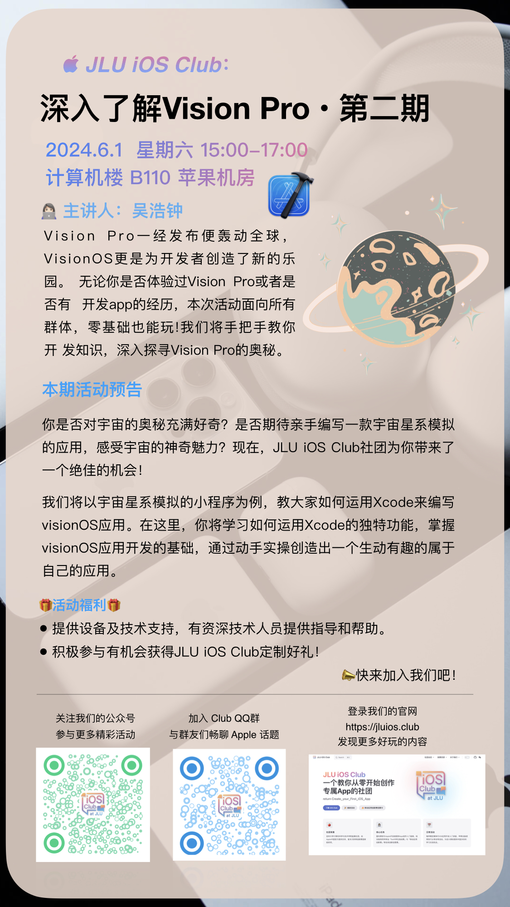

# 《深入了解 Vision Pro》系列活动 <Badge type="danger" text="第二期" />

> 🚀 Xcode实操大挑战：用Xcode编写宇宙星系模拟的visionOS 应用！🚀

亲爱的同学们，

你是否厌倦了纸上谈兵，渴望将编程知识付诸实践？你是否想亲手编写一款炫酷的应用，展示你的编程实力？JLU iOS Club社团为你带来了一个绝佳的机会，我们将以**宇宙星系模拟**的小程序为例，教你**实操 Xcode**，开启 VisionOS 应用开发之旅。

📣 吉林大学 Doers&Dreamers iOS Club（简称JLU iOS Club）在全校范围内组织举办的《深入了解Vision Pro》系列活动，**第二期**即将开启！

## 📅 活动时间地点：

### 第二期活动 <Badge type="tip" text="NEW" />

- 📅 时间： 2024年6月9日（周六）15:00~17:00
- 📍 地点： 前卫南区计算机楼 B110 苹果机房
- 👨‍💻 主讲人：高德昊

## 🌟 活动亮点：

1. 提升技能：通过实操Xcode，你将获得宝贵的编程经验，提升你的编程能力和解决问题的能力。
2. 跨学科学习：本次活动将编程与天文知识相结合，让你在学习的同时，也能拓宽视野，增长见识。
3. 创新创造：你将有机会亲手打造一款独一无二的宇宙星系模拟小程序，展示你的创意和编程才华，赢得同学们的赞赏和认可。

## 🎁 活动福利：

* 现场提供设备支持，并将有资深技术人员亲自指导，解答你的疑惑。
* 活动中有机会体验到 Vision Pro，并获得 JLU iOS Club 定制好礼！

## 📣 报名方式：

填写[第二期活动-在线报名表](https://docs.qq.com/form/page/DTGdNTHpyZXBieHdM)即可轻松报名！名额有限，先到先得！

## 💪 行动起来！

让我们一起深入探索 Apple Vision Pro 的奥秘，掌握 Xcode 开发工具，开启 VisionOS 应用之旅！这不仅是一次学习的机会，更是一次挑战自我、展现才华的舞台。我们期待你的加入！
