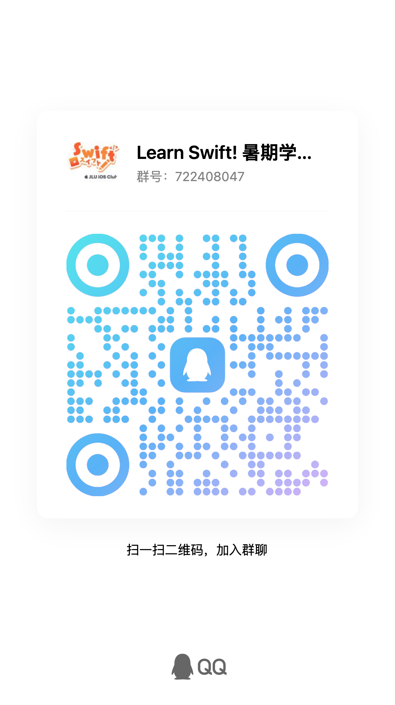

# _Learn Swift!_ 暑期学习打卡挑战 <badge type="warning">Summer Challenge</badge>

来参与JLU iOS Club 的暑期学习打卡挑战，一起学习Swift吧！

## 💪 打卡目标

7月15日 ～ 8月11日 （一个月）从以下三个目标中选择一个完成，期间完成打卡即可获得奖励：

1. 学习 ChaoCode 的 [Swift 课程（基础篇）](/resources/#swift-学习资源)
2. 学习 ChaoCode 的 [Swift 课程（中级篇）](/resources/#swift-学习资源)
3. 学习 [原型设计工具](/resources/#app-原型设计)（如 Figma）

<el-button tag="div" type="primary" size="large" round>
    <a href="/resources/">📑 相关学习资源</a>
</el-button>

::: warning 打卡要求

若需完成 ChaoCode 的学习打卡，请在每日打卡时附上一次**作业完成的截图**（作业答案已随题附上）

若需完成 Figma 的学习打卡，请在每日打卡时附上一次**原型设计工具的使用截图**

:::

## 🤩 达标奖励

帽子、T恤、马克杯、帆布袋、…… 随你选～

还有志愿时长相送！

| 累计打卡天数 | 礼品                | 附加志愿时长 |
|--------|-------------------|--------|
| 7天     | Club定制礼品任选其一      | 15 小时  |
| 10天    | Club定制礼品任选其二      | 30 小时  |
| 14天    | Club定制礼品**全部带走！** | 45 小时  |

打卡天数领先的同学，后续 Xcode 开放学习营可获得**优先入营机会！**

## 🥺 加入我们的打卡群吧～

QQ 群号：[722408047](https://qm.qq.com/q/q57WUAgMYS)

每日在群内打卡，即可获得奖励。并有社团同学助你学习～

