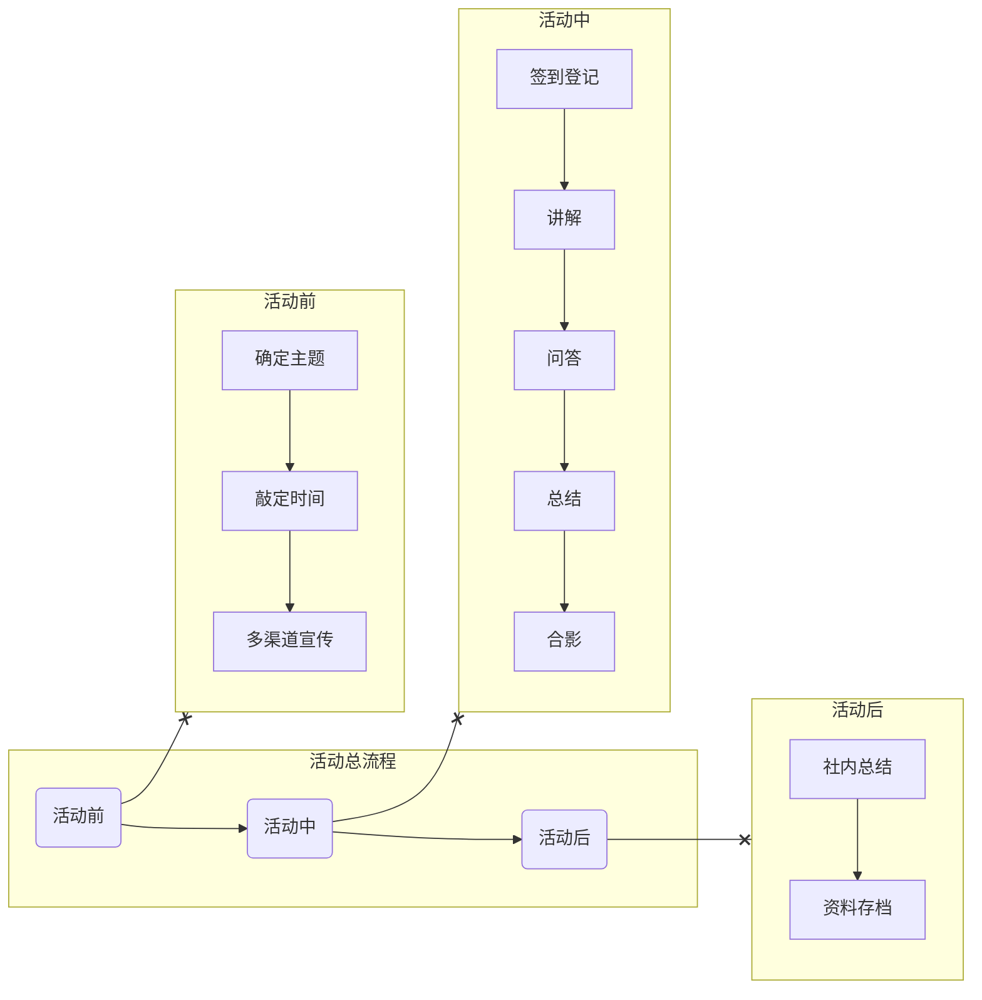

# 社团活动

::: warning
此页面仍在建设中，部分内容还未完成，敬请期待！
:::

  <h2>{{column.text}}</h2>
  <ul>
    <li v-for="item in column.items" key="item.text">
      <el-link @click="router.go('/activities/'+item.link)" :disabled="item.link=='/'" style="font-size: 1rem">
        {{item.text}}
      </el-link>
      <Badge type="danger" text="NEW" v-if="item == theme.sidebar['/activities/'].items[0].items[0]"/>
    </li>
  </ul>

## 活动流程

