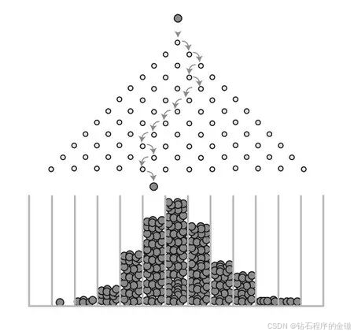
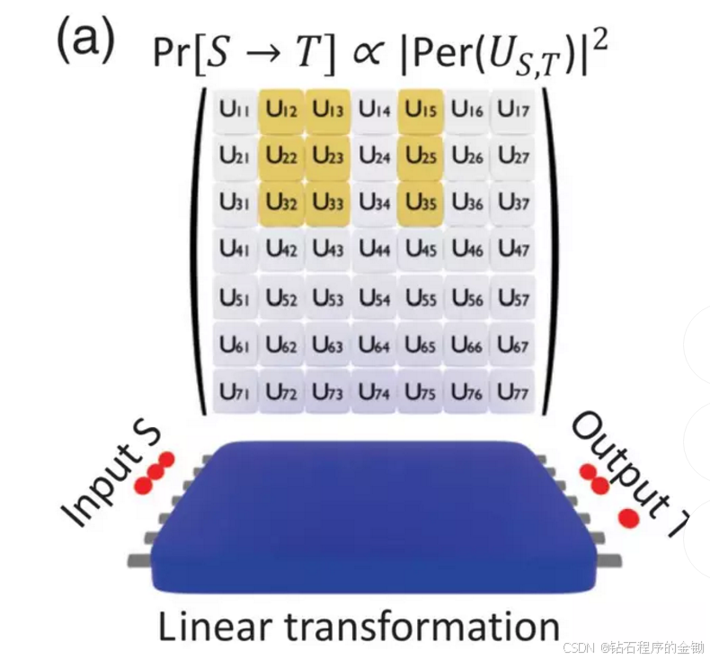

# 浅谈量子计算中的高斯波色取样 
## 前言

> 高斯波色取样（Gaussian Boson Sampling，简称GBS）是一种量子计算任务，主要用于展示量子计算在某些特定任务上相较于经典计算的潜在优势。以下是高斯波色取样的基本概念和原理，用易于理解的方式进行讲解：
> ### 1. 背景知识
>- **波色子**：一种基本粒子，例如光子（光的基本单位），属于波色子家族。
>- **高斯状态**：一种特殊的量子态，可以通过操纵光子来实现。高斯态的特性由其均值和协方差矩阵来描述。
>### 2. 任务描述
>高斯波色取样任务的目标是从一个量子光学系统中采样出特定的光子分布。这听起来有点复杂，但我们可以一步步拆解。
>### 3. 系统构造
>1. **输入光子**：将一组光子输入到一个复杂的光学网络中，这个网络由多个分束器和相位移器组成。
>2. **光学网络**：通过这些光学器件，输入光子会被分成不同路径并发生干涉，形成复杂的叠加态。
>3. **检测器**：在网络的输出端安装一组光子检测器，用来记录输出的光子分布情况。
>### 4. 工作原理
>- **输入态**：首先将光子以某种高斯态的形式输入到光学网络中。
>- **光子干涉**：光子在光学网络中经过多次干涉，最终形成一个复杂的量子态。
>- **输出态**：通过检测器来测量输出光子的分布，这个分布不是随机的，而是受量子干涉影响，具有特定的统计特性。
>### 5. 难点与优势
>- **经典计算难以模拟**：对于大规模的光学网络，经典计算机很难精确模拟光子在其中的干涉和输出分布，因为计算复杂度随着光子数量和光学网络规模呈指数增长。
>- **量子优势**：量子计算机可以在较短时间内完成这种取样任务，而经典计算机则可能需要极长时间才能完成。
>### 6. 应用前景
>高斯波色取样主要用于证明量子计算的潜在优势，尤其是在某些特定的计算任务上。这类任务虽然暂时还没有直接的商业应用，但为量子计算的未来发展奠定了基础。
## 一、到底是什么
有一些文章中会有这样一个图片来表示，非常专业
所谓“玻色取样”问题，我们可以理解成一个量子世界的高尔顿板。高尔顿板问题是由英国生物统计学家高尔顿提出来的，这个问题的模型如第一个图片所示，小球从最上方被扔下，每经过一个钉板，**都有一半的可能从左边走，一半的可能从右边走**，当有很多个小球从上往下随机掉落时，落在下面的格子里的小球数量分布上会呈现一定的统计规律，这个模型可以用来直观地认识中心极限定理。

**玻色取样**是量子计算领域的一个重要概念，它涉及到多个相同的玻色子（例如光子）通过一个干涉仪（也叫线性变换器）后的行为分析。具体来说，我们可以用一个简单的例子来解释这个概念。

假设我们有一个7输入7输出的干涉仪，称之为“7进7出干涉仪”。现在我们有3个完全相同的光子（玻色子），它们一起通过这个干涉仪，最终会分布在不同的输出端口上。我们想知道它们在特定的端口上分布的概率。

具体问题是：在1号、2号和3号端口同时输入3个光子后，这些光子最终会出现在2号、3号和5号端口各一个的概率是多少？

Aaronson和Arkhipov的研究指出，这种分布概率与一个叫做“Permanent”的数学概念有关。Permanent是一个矩阵的特定计算结果，可以简单理解为一系列数相乘再相加的复杂计算。Permanent的计算非常复杂，甚至比我们常见的矩阵行列式（Determinant）还要复杂。

从计算复杂度的角度来看，求解Permanent是一个非常难的问题，被认为是**P-hard**。这意味着，即使是最强大的经典计算机，也需要很长时间来计算。当光子的数量增加时，计算所需的步骤数以指数级增长。

目前，最好的经典算法需要O(n2^n)步来计算Permanent，这里的n是光子的数量。例如，对于10个光子，计算所需的步骤大约是1024步（10乘以2的10次方）。对于更大的n，这个数字会迅速变得难以承受。

因为这个问题对于经典计算机来说非常困难，所以科学家们希望通过量子计算来解决。量子计算在处理这种问题上有潜在的优势，即使在中小规模的情况下，也有可能超过目前的超级计算机。这使得“玻色取样”成为量子计算领域的一个热门研究方向。科学家们希望通过解决“玻色取样”问题，来展示量子计算在处理复杂计算问题上的巨大潜力。

## 二、深入理解
### 1.玻色取样和蒙特卡洛模拟
首先，玻色取样是量子计算领域的一种方法，用来生成特定的随机分布结果。这个过程类似于一种叫做蒙特卡洛模拟的方法，蒙特卡洛模拟是一种通过大量随机取样来模拟复杂系统的方法。在传统计算机上，蒙特卡洛模拟通过软件实现，而在玻色取样中，这种模拟是通过量子硬件实现的。
### 2.模拟信号 vs 数字信号
模拟信号和数字信号是两种不同的信息处理方式，各有优缺点。让我们来看看它们的区别：
- **模拟信号的优势：**
  1. **高精度**：模拟信号的精度理论上可以无限高。例如，当你点燃鞭炮时，瞬间爆炸产生的各种物理参数（如温度、压力等）可以非常精确，这些精度是数字信号难以达到的。
  2. **快速生成**：一些复杂的物理现象（如核爆炸）在现实中发生的时间非常短，但要在计算机中模拟这些现象可能需要很长时间。例如，真实的核爆炸只需几秒钟，但在超级计算机上进行精确的核爆炸模拟可能需要数月。
- **数字信号的优势：**
  1. **抗干扰能力强**：数字信号不易受到外界噪声的影响，数据更可靠。例如，数字通信中的“0”和“1”在传输过程中不容易被干扰，而模拟信号可能会因为噪声失真。
  2. **差错可控**：数字信号可以通过编码和校验等技术来检测和纠正错误，提高数据的准确性。
  3. **易加密和存储**：数字数据可以很容易地进行加密，保护信息安全；而且数字数据可以压缩和存储在各种介质上，便于管理和传输。
  4. **易与现代技术结合**：现代计算技术（如计算机、互联网）主要基于数字信号，因此数字信号更容易与现有技术系统集成。
### 3.现实模拟与计算模拟
我们可以通过现实中的物理现象来理解模拟信号的优势。比如：

- **核爆炸**：一个真实的核弹爆炸会瞬间产生极为复杂的物理现象和数据，但要在超级计算机上模拟这个爆炸过程需要很长时间。
- **生成无理数**：在现实中，产生一个无理数（例如圆周率π）的某些值非常容易，但要在计算机中精确计算这个无理数的所有小数位是不可能的，因为无理数有无限多的非重复小数位。
## 三、从模拟信号进入量子计算
### 1.蒙特卡洛模拟的经典理解：
蒙特卡洛模拟是一种利用随机数生成大量样本来近似求解复杂问题的方法。例如，要计算一个复杂系统的特定输出概率或行为，我们可以通过大量的随机抽样来模拟系统的不同状态，从而得到所需的结果。这种方法在经典计算机上通过软件实现，是一种强大的数学工具，尤其在处理难以精确解析的问题时非常有用。
### 2.量子计算的特性：
量子计算则利用量子位（Qubit）的特性，即可以同时处于多种状态的叠加态，来实现更高效的计算。例如，两个量子位可以表示四种状态，因为它们可以同时处于0和1的叠加态。随着量子位数量的增加，量子计算机的存储能力呈指数级增长，可以同时处理大量数据的多种可能性。
### 3.量子计算机的并行性和量子门操作：
在量子计算机中，通过量子门操作可以改变量子位的状态，并利用量子纠缠来实现远距离的信息传递和协同操作。这种并行性使得量子计算机在某些问题上比经典计算机更为高效，因为它能够同时处理多个可能性，而不是逐个进行。
### 4.蒙特卡洛模拟与量子计算的关联：
尽管蒙特卡洛模拟本质上是经典计算的一种方法，但可以想象，在量子计算机上实现类似的随机抽样过程可能会更加高效。量子计算机可以利用其并行性和量子态的复杂性，以一种全新的方式执行类似蒙特卡洛模拟的任务。例如，量子计算机可以同时模拟系统的多种可能状态，并通过量子门操作来改变和探索这些状态，从而加快复杂问题的解决速度。
## 四、深入模拟计算与量子计算
### 1.蒙特卡洛模拟的特性：
蒙特卡洛模拟是一种通过大量随机样本来近似解决复杂问题的方法。在这种模拟中，每个数据点的生成是通过模拟物理过程来实现的，而不需要深入计算每一个数据点产生的具体过程。例如，当模拟两个小球碰撞时，我们不需要精确计算碰撞发生时每个小球的速度、角度和质量，而是根据真实物理现象来模拟它们碰撞后的运动状态。这种方法能够快速生成结果，特别是在处理复杂的物理现象或难以解析的问题时非常有效。
### 2.量子计算的不同之处：
量子计算则利用量子位的特性，即可以同时处于多种状态的叠加态，来进行高效的并行计算。量子计算机通过量子门操作可以改变量子位的状态，并利用量子纠缠实现远距离的信息交互和复杂计算。与蒙特卡洛模拟不同的是，量子计算机的每个数据的处理过程需要通过清晰的计算过程来解释和执行。虽然量子计算机可以处理大量数据并实现高效的并行计算，但它的运算过程和结果仍需遵循精确的量子理论。
### 3.量子计算机的优势和挑战：
量子计算机的真正优势在于其能够利用量子位的并行性和量子纠缠来解决一些传统计算机无法处理的问题，尤其是在复杂问题的模拟和优化方面。虽然量子计算机的理论潜力巨大，但其开发和利用也面临技术上的挑战，例如如何保持量子位的稳定性和实现足够的量子门操作。
## 五、总结
在量子计算领域，高斯波色取样（GBS）展示了量子计算在特定任务上的潜在优势。通过复杂的量子光学网络，GBS能够快速生成特定光子分布，这在经典计算机上是极具挑战性的。量子计算利用量子位的并行性和量子纠缠，能够更高效地处理这类任务，从而为未来量子计算的发展奠定了基础。