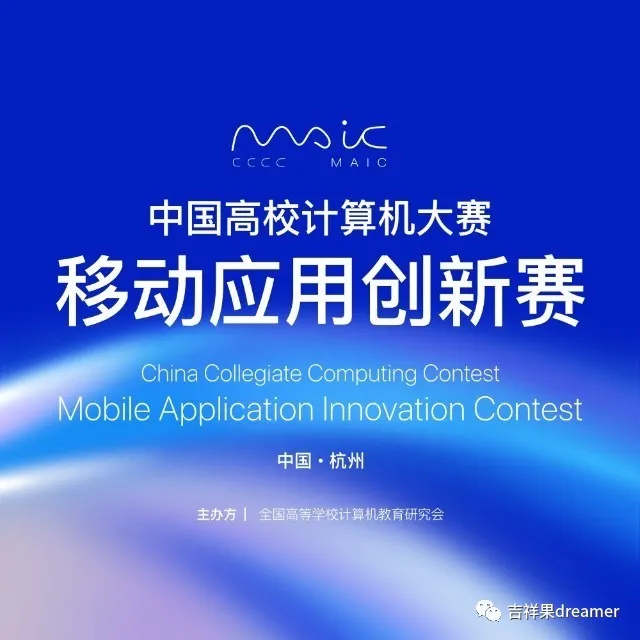
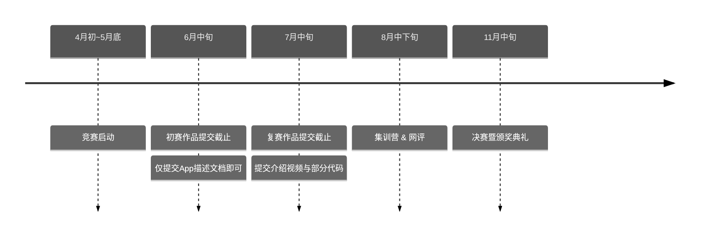

# 中国高校计算机大赛——移动应用创新赛

## 竞赛亮点

- 由教育部高等学校计算机类专业教学指导委员会等四大部门联合创办，全国高等学校计算机教育研究会主办；
- **Apple中国官方支持**，与浙江大学联合举办，连续多年入选全国普通高校大学生竞赛排行榜；
- 获奖作品有机会直通“互联网+”、大创等创新创意赛，推荐进入全国总决赛；
- 参赛**完全免费**，国家一等奖可获**Apple全家桶**，更有机会与Apple公司CEO库克面对面交流。
- 自2022年起列入**吉林大学B*类竞赛**，享有加分和推免等政策！

## 参赛须知

::: danger 注意
参赛指南自 2024 年起有较大变动，本文已针对新要求作出更新，并请以官方文档为准：[🔗参赛指南](http://www.appcontest.net/details/entryGuide)、[🔗参赛通知](https://mp.weixin.qq.com/s/lxU5EA_OYr_zvht_UTTvmQ)

重大变化：作品说明文档不再要求 PPT 形式，而是提供[文字模版](https://oss.moocollege.com/24402/edit/eqCMRHZr_1717036700538.docx)并限定字数
::: 

这是一场以 iOS/PadOS 系统设计开发应用程序的高端竞赛。学生组成一个两到三人的队伍，在创新创意赛道上提交自己的原创 App 原型，在决赛时最终实现并完善。参赛者可自由命题，鼓励参赛队伍使用Swift语言进行开发。

值得一提的是，Swift 学生挑战赛的获奖选手经推荐可直通移动应用创新赛复赛，而两个比赛之间的内容也互有重合，很适合一同参赛。不同点在于，移动应用创新赛更注重于应用的创新性与设计，**并不要求选手有很强的编程能力**（甚至理论上可以无需提交一行代码就抵达决赛圈）。

### 启迪赛道（原创新赛道）
启迪赛道的参赛作品须为具有一定功能的原创性应用程序（App），**适合具有App开发人员的团队**。每支参赛队最多由**3名队员**组成。共设国奖共近60个名额，具体奖项设置可前往[竞赛官网](http://www.appcontest.net/details/entryGuide)查看。奖品丰厚，**最高奖团队总计可获得总价值约 12 万元的苹果全家桶奖励。获奖团队有机会直推互联网+全国总决赛。**

::: tip
若您的 App 可以在 App Store 顺利**上架**，按照之前的参赛经验，即可至少获得**国家二等奖**。
::: 

### 启明赛道（原创意赛道）

启明赛道的作品须提供iOS/iPadOS系统设计开发的应用程序原型，**适合只有设计人员的团队**。每支参赛队最多由**2名队员**组成。复赛获奖团队有机会转至启迪赛道参与全国总决赛，组委会将为其在比赛官方平台发布队员招募通知。

### 启航赛道（新增赛道）

采用邀请制+报名制，鼓励曾参加过竞赛的上架作品，或是有创业、宣传需求的**毕业生**（五年内），参加竞赛。要求 App 必须上架 App Store 或 Testflight 可运行。关注作品商业模式与商业前景，选择启航赛道的参赛队伍必须提交**商业计划书**（10页以内）及作品下载链接，可自主选择提交作品介绍视频。

## 作品主题要求

主题须紧扣竞赛推荐的应用领域及其他**社会关注的热点难点问题**，包括但不限于能源、健康医疗、环保、养老、智慧交通、智慧城市、智慧物流、与社会创新相关的物联网、食品安全、与社会服务相关的大数据/云服务等。参赛者**可自由命题**，自行搜集、获取相关数据，提供解决方案并能在移动设备上实际运行。

部分历年获奖作品：[2023年](https://sspai.com/post/82738) [2022年](https://sspai.com/post/75611) [2021年](https://sspai.com/post/70453)

## 赛制

[//]: # (TODO: 之后尝试使用element plus时间线替代)

|   阶段    |   时间    | 要求                                                          |
|:-------:|:-------:|:------------------------------------------------------------|
|   初赛    | 6月20日截止 | 仅提交有关 App 的描述文档即可（使用模板），无论是哪一赛道均无需提交任何代码                    |
| 复赛（赛区奖） | 7月20日截止 | 在复赛基础上完善作品说明文档，并补充提交简短的介绍视频。启迪赛道建议提交部分核心代码，启明赛道建议提交产品原型图。   |
|  全国总决赛  |  11月中旬  | 组委会提供竞赛训练营，免费提供开发者账号，决赛参赛作品必须能进行现场演示（路演），苹果公司将提供必要的技术支持。    |

### 时间线

