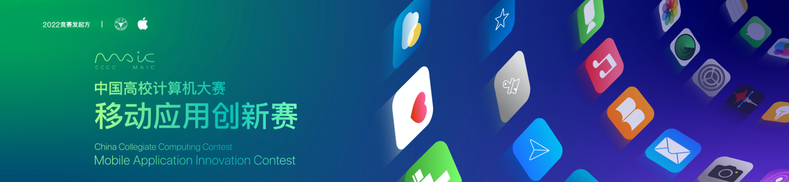
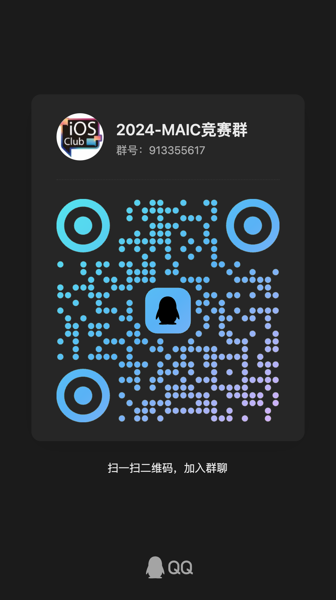

# 中国高校移动应用创新赛又双叒叕来啦！甚至这次，0基础也能来！

> 想要揽获**总价值12万**的大奖吗?
>
> 想要被推荐参加**互联网+**、**大创**全国总决赛吗？
>
> 想与Apple公司CEO**库克**面对面交流吗？
>
> 想要通过代码实现创意、上架APP吗？
>
> 或者——**编程0基础**也想展现自己？
>
> ……
>
> 快来参加 **_移动应用创新赛_** 吧!

::: warning 特别鸣谢
我社与[吉林大学安诺希校园体验中心](/news/an-nuo-xi/)达成合作，免费向社团成员提供一台** Vision Pro**的借用权，以及联合Apple官方向参与竞赛的同学借用**Macbook Pro**用于开发！
:::

这是由 Apple 和浙江大学联合举办的，一场以 iOS/iPadOS 系统设计开发应用程序的高端竞赛。学生组成一个两到三人的小队，在创新或创意赛道上提交自己的原创 App 原型，在决赛时最终实现并完善。

移动应用创新赛目前唯一一项被中国高等教育学会纳入全国普通高校学科竞赛排行榜、面向各大高校学子推出的和基于 iOS 平台相关的移动应用相关的竞赛。在吉林大学计算机学院，移动应用创新赛与蓝桥杯、数学建模比赛等同属于 B* 类竞赛，对未来保研加分等均能提供帮助。

值得一提的是，Swift 学生挑战赛的获奖选手经推荐可直通移动应用创新赛复赛，而两个比赛之间的内容也互有重合，很适合一同参赛。不同点在于，移动应用创新赛更注重于应用的创新性与设计，并不要求选手有很强的编程能力（甚至可以无需提交一行代码就抵达决赛圈）。

### 关键亮点

- **Apple中国官方支持**，与浙江大学联合举办，连续多年入选全国普通高校大学生竞赛排行榜；
- 获奖作品有机会直通“互联网+”、大创等创新创意赛，推荐进入全国总决赛；
- 参赛**完全免费**，国家一等奖可获**Apple全家桶**，更有机会与Apple公司CEO库克面对面交流。
- 自2022年起列入**吉林大学B*类竞赛**，享有加分和推免等政策！

<el-button tag="div" type="primary" size="large" round>
    <a href="/competitions/maic/">👉 了解更多竞赛信息</a>
</el-button>

---

### 🔥 加入2024-MAIC竞赛群

