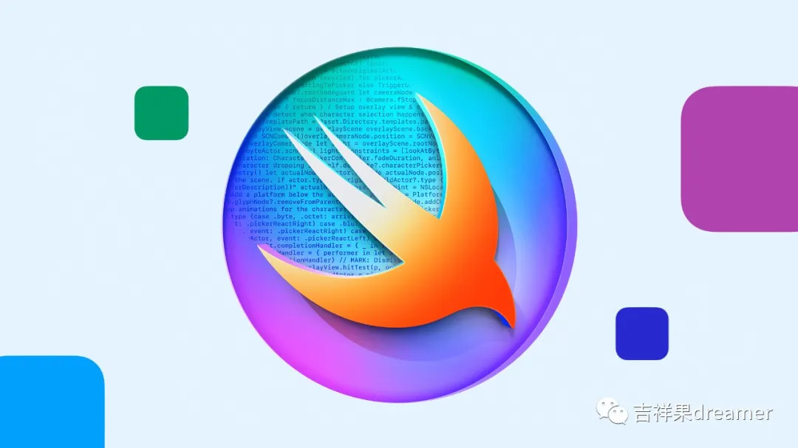

# WWDC-Swift学生挑战赛

每年的二或三月份，苹果面向全球举办 WWDC-Swift 学生挑战赛，选拔 350 名开发者给予奖金，来支持和激励新一代开发者、创作者和企业家。学生只需要通过 App Playground **提交一份能在几分钟内完成演示的 App**，展现自身的创造力和编程能力，就有机会赢得为期一年的 Apple Developer Program 会员资格、参加 App Development with Swift 认证考试的免费凭证，以及 Apple 准备的特别礼物！

对于即将到来的 WWDC24，苹果比往年更早公布了挑战赛，并且**时间刚好在时间充裕的寒假二月份**，我们可以做好充足的准备。2024 年挑战赛还新增了一项机制，Apple 还将在 350 名获奖者中选出 50 名杰出获奖者，并对这些提交了优秀作品的杰出获奖者予以表彰，邀请前往位于库比提诺的 Apple 园区体验一次非凡之旅。