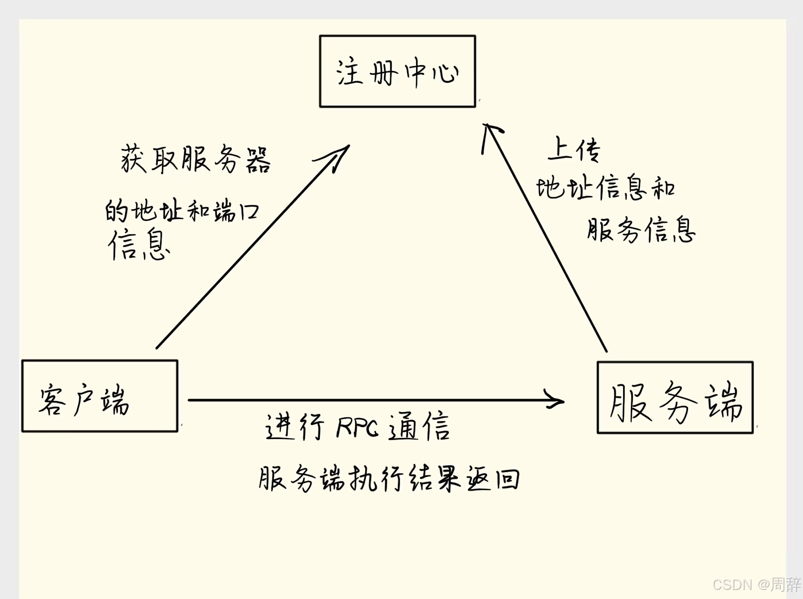
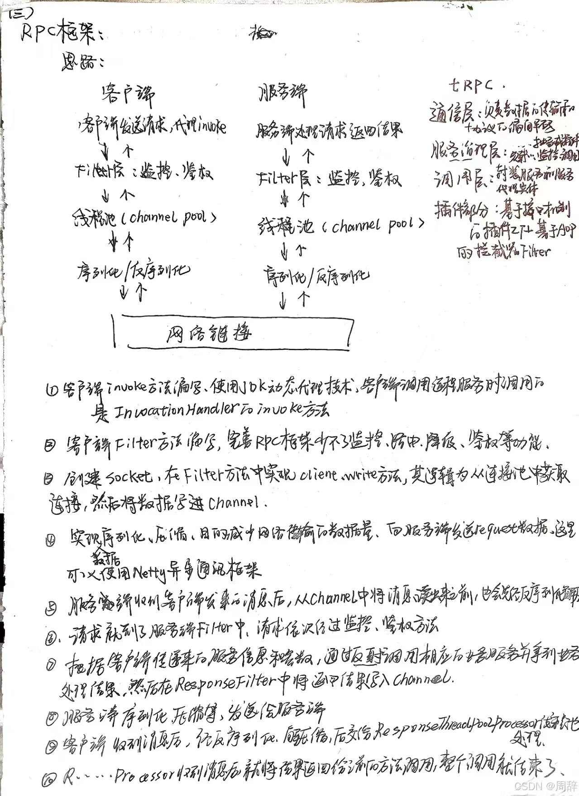
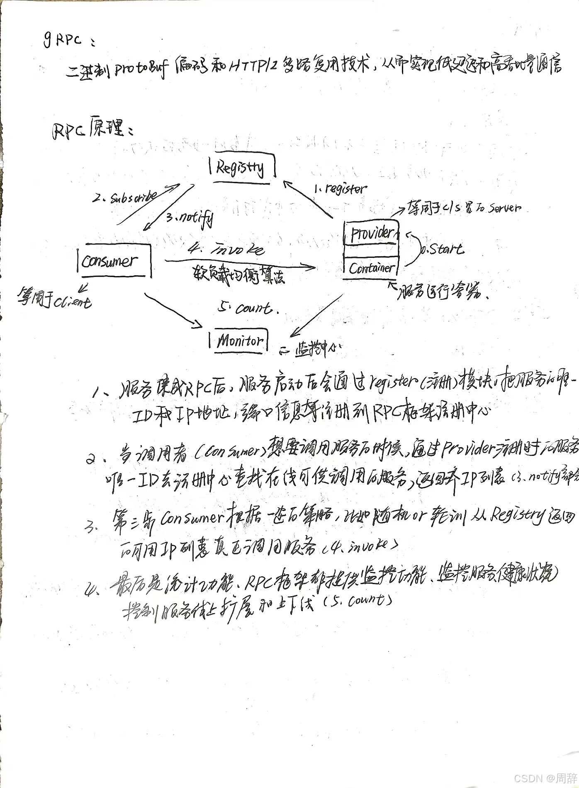
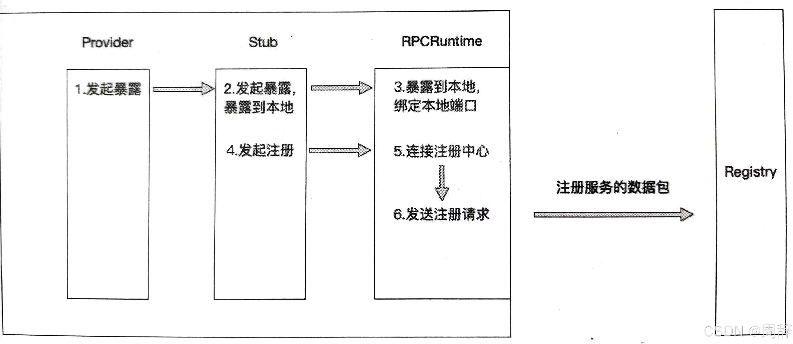
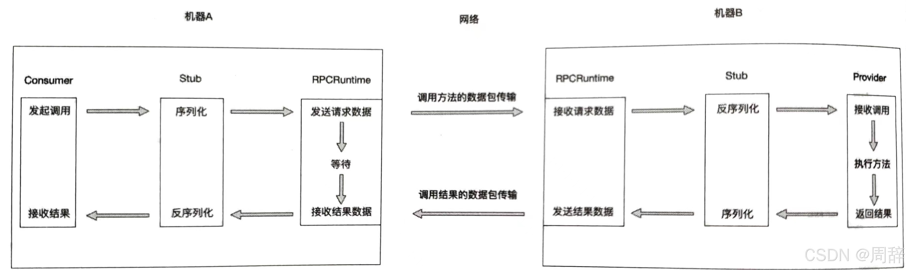
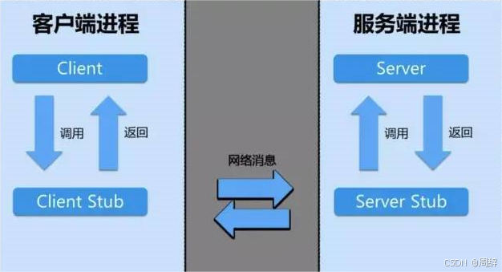

# 女生放弃看电视剧，也要看的RPC框架
**红了樱桃，绿了琵琶，不如趁早来学RPC框架**
---
# 前言
---
`什么是RPC？`

`RPC 称远程过程调用（Remote Procedure Call），用于解决分布式系统中服务之间的调用问题。通俗地讲，就是开发者能够像调用本地方法一样调用远程的服务。所以，RPC的作用主要体现在这两个方面:`

(1)屏蔽远程调用跟本地调用的区别，让我们感觉就是调用项目内的方法；

(2)隐藏底层网络通信的复杂性，让我们更专注于业务逻辑。

**个人理解：我觉得其实在这套体系里面，注册中心是极为重要的，如果没有注册中心，客户端和服务端进行通信就跟传统通信方式一致了，我觉得是极致运用代理模式的结晶，服务端通过暴露自己的接口把服务唯一的ID和IP地址，端口信息等推送到注册中心（其实这就有个坑，注册中心怎样知道服务端还在呢？如果读者了解过分布式，其实不难想到心跳机制），现在客户端就可以通过JDK动态代理技术，在Proxy拿着唯一ID去注册中心直接调用服务**

**看了上面的内容，你肯定会在想为啥明明有了Htttp协议，还要使用RPC技术？**

  _随着互联网的发展，业务和系统在不断的迭代升级，而原有的Htttp协议需要重复3次握手和4次挥手的操作不断建立新的链接，而RPC却能支持长链接；RPC基于TCP协议实现，能更灵活地对协议字段进行定制，相比于Htttp能减少网络传输的字节数，降低网络开销，提高性能，实现更大的吞吐量和开发数；RPC框架中由于有注册中心，可以提供监控管理功能，服务注册/发现/下线/动态，拓展等操作，服务化治理效率大大提高_

# 一、RPC 框架通信流程以及涉及到的角色？

---

# 二、原理

**RPC调用过程可以分为四个阶段:_服务暴露过程_、_服务发现过程_、_服务引用过程_和_方法调用过程_。**

 `服务暴露:`**如果只暴露在本地，进行服务暴露就会绑定一个端口用于监听和接收Consumer端的连接和请求，这个其实RPCRuntime完成的，比如一个Dubbo服务，默认的协议端口是20880，当进程启动后，应用服务进程会监听20880端口。当应用进程准备好所有应该暴露的服务并且完成端口的绑定和监听后，服务暴露到本地的过程也随之结束。如果暴露到远程，则需要统一的管理中心（即==注册中心(Registry)==）来管理所有应用服务的地址和服务信息**

`服务发现:`**服务发现的过程发生在(Consumer)端，服务发现的过程也就是寻址的过程，Consumer端如果要发起RPC调用，则需要先知道自己想要调用的应用服务有哪些服务提供者，也就是需要知道这些服务提供者的地址和端口。如果采用直连式（对应Provider端的第一种服务暴露方式），Consumer端根据服务暴露的地址和端口直接连接远程服务，但是每次服务提供者的地址和端口变更后，服务消费者都需要随之变更配置的地址和端口，这种多用于做服务测试；如果注册中心式，Consumer端通过注册中心进行服务发现（即获取服务提供者的地址和端口从注册中心），==当服务提供者变化时，注册中心能够通知服务消费者有关服务提供者的变化==。**

 `服务引用:`**服务引用的过程发生在服务发现之后，当Consumer端通过服务发现获取所有服务提供者的地址后，通过负载均衡策略选择其中一个服务提供著的节点进行服务引用。服务引用的过程就是与某一个服务节点建立连接，以及在Consumer端创建接口的代理的过程其中建立连接也就是两端的RPCRuntime 建立连接的过程。**

`方法调用:`**当服务引用完成后，Consumer端与Provider端已经建立了连接，可以进行方法的调用**

(1)服务消费者以本地调用方式(即以接口的方式)调用服务，它会将需要调用的方法、参数类型、参数传递给服务消费方的本地存根。

(2)服务消费方的本地存根收到调用后，负责将方法、参数等数据组装成能够进行网络传输的消息体(将消息体对象序列化为二进制数据)，并将该消息体传输给RPC通信者。

(3)Consumer 端的RPC通信者通过sockets 将消息发送到Provider端，由Provider端的RPC通信者接收。Provider端将收到的消息传递给服务提供方的本地存根。

(4)服务提供方的本地存根收到消息后将消息对象反序列化。

(5)服务提供方的本地存根根据反序列化的结果解析出服务调用的方法、参数类型、参数等信息，并调用服务提供方的服务。

(6)服务提供方执行对应的方法后，将执行结果返回给服务提供方的本地存根。

(7)服务提供方的本地存根将返回结果序列化，并且打包成可传输的消息体，传递给Provider端的RPC通信者。

(8) Provider端的RPC通信者通过sockets将消息发送到Consumer端，由Consumer端的RPC通信者接收。Consumer端将收到的消息传递给服务消费方的本地存根。

(9)服务消费方的本地存根收到消息后将消息对象反序列化。反序列化出来的是方法执行的结果，并将结果传递给服务消费者。

(10)服务消费者得到最终执行结果。
# 三、具体调用过程

`在远程调用中，对于Consumer发起的函数调用，Provider如何精准的直到自己应该执行哪个函数呢？`

这就需要stub了。Stub的存在就是为了让远程调用像本地调用一样直接进行函数调用，无须关系地址空间隔离、函数不匹配等问题。
**Stub的职责就是进行类型和参数转化。**本地存根分为服务调用方的本地存根和服务提供方的本地存根。

服务调用方的本地存根和服务消费者都属于Consumer端，它们存在于同一台机器上，服务调用放的本地存根会接收Consumer的函数调用，本地存根会解析函数调用的函数名、参数等信息，整理并且组装这些数据，然后将这些数据安装定义好的协议进行序列化，打包成可传输的消息，交给RPCRuntime（RPC通信者）。服务调用方的本地存根除了会处理服务消费者提供的方法、参数、方法参数类型等数据，还会处理服务提供方返回的结果，它会将RPCRuntime返回的数据反序列化成服务调用方所需要的数据结果并传递给服务消费方。

从服务消费方的角度来看，Stub隐藏了远程调用的实现细节，就像是远程服务的一个代理对象，可以让服务消费方感觉调用远程服务方法就像调用本地方法一样。

服务提供方的本地存根与服务提供方都属于Provider端，它们一起存在于同一台机器上。当Provider端的RPCRuntime收到请求包后，交由服务提供方的本地存根进行参数等数据的转化。服务提供方的本地存根会重新转换客户端传递的数据，以便在Provider端的机器上找到对应的函数，传递正确的参数数据，最终正确地执行真实函数的调用。等函数执行完成后，服务提供方会将执行结果返回给服务提供方的本地存根，由本地存根再将结果数据序列化、打包，最后交给RPCRuntime。服务提供方的本地存根与服务调用方的本地存根一样都是充当了翻译员的角色。
# 四、总结
`举个例子：`

**现在有一个订单服务应用，其中订单服务提供了查询订单等方法。现在需要将该订单服务部署在三个节点上，分别是节点A、节点B和节点C。除了订单服务，还有一个用户服务，用户服务内的一个查询订单的功能需要调用订单服务的查询订单方法。所以这里的订单服务就是服务提供方，而用户服务就是服务消费方。订单服务每在一个节点上完成部署后，该节点的信息都会被注册到注册中心。当用户服务启动时，知道该服务依赖订单服务，所以会先从注册中心执行服务发现的过程，发现订单服务有三个节点提供服务，选择其中一个节点后，与该节点建立连接。当用户发起查看订单的请求时，用户服务会向该节点发送需要调用的方法信息，也就是查询订单方法的方法名、参数类型、参数等。等订单服务执行完成后将结果返回给用户服务，这个过程中订单服务与用户服务之间的连接一直保持活跃。当订单服务的该节点下线时，注册中心通知用户服务该节点已下线，当下次用户服务又发起对订单服务的调用时会选择另一个节点建立连接，并且发送调用请求，这就是远程过程调用的全部过程。**
