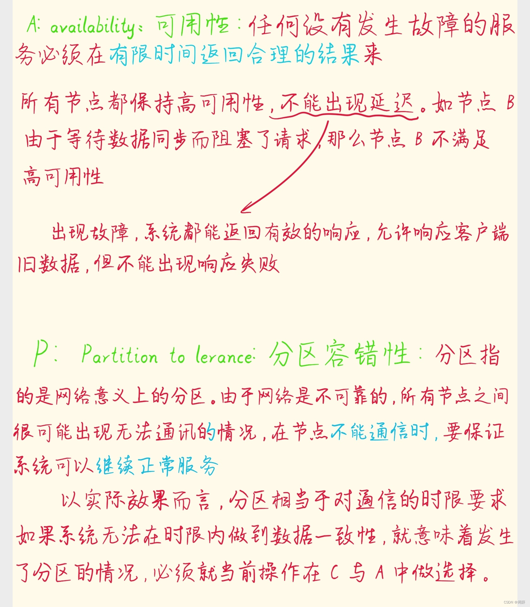
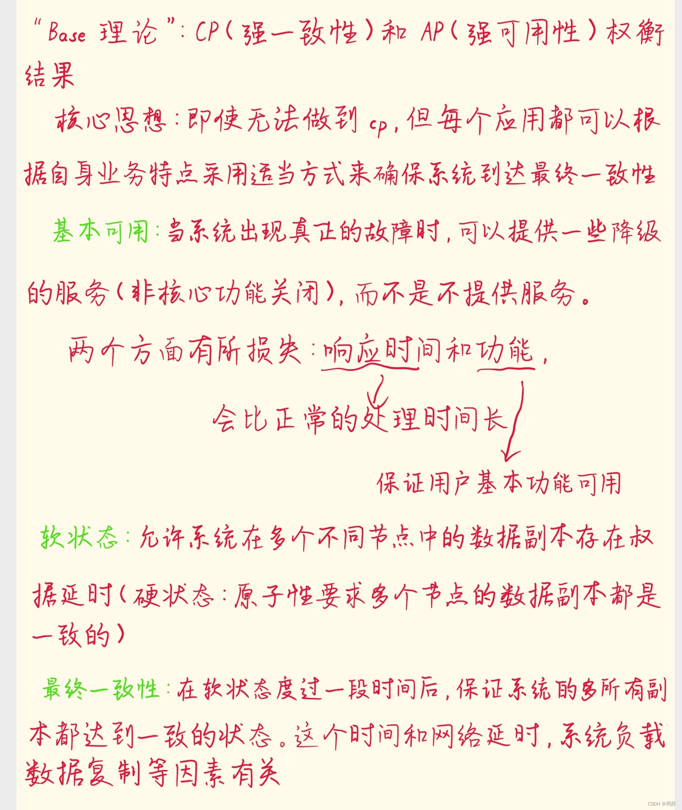
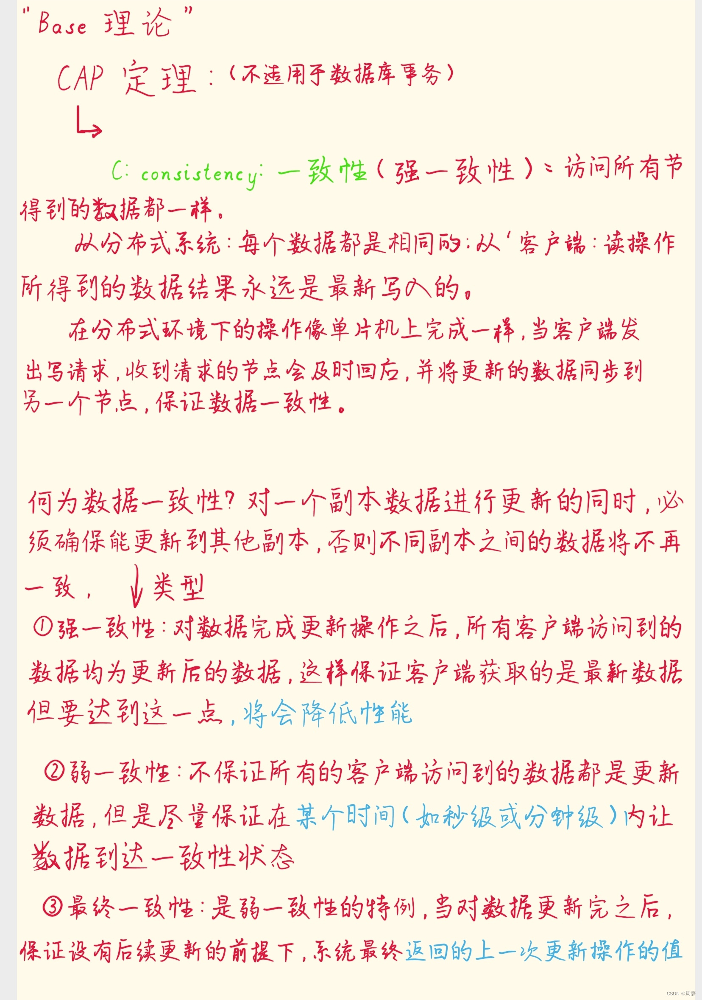

----
## 一.CAP理论剖析

` 概要：CAP 定理指出了，在一个跨区域网络连接，共享数据的分布式系统中，一致性(Consistency)，可用性(Availability)和分区容错性(Partition Tolerance) 这三个约束属性最终只能同时满足二个。`

个人笔记如下：

### 1.1.CAP原理细节举例分析
    假设有两个节点 data1 和 data2，以及一个变量数据 number = 1；这时有写请求向 data1 提交了更新，
    将数据number改变为2。接着 data1 就需要将更新后的数据同步给 data2 ，让 data2 更新number的最新值。

就3个场景去分析：

1.在保证CP的情况下
        为了保证数据数据一致性，data1 需要将数据复制给 data2，那么两个节点之间需要建立通信，可由于网络原因，通讯出现了问题，导致失败了，比较网络是不可靠的。不过系统又保证了分区容错性，这时候 data2 就不一定能够及时的收到 data1 推送来的数据同步信息。当客户端有请求来访问 data2 的number数据时，为了保证数据一致性，data2 只能阻塞，或者返回错误，提示系统发生了错误，然后等待数据真正同步完成后再返回。

::: warning 重点
        所以，在保证C and P的情况下，是无法同时保证A的.
:::

2.在保证AP的情况下
        为了保证系统的高可用性，data1 和 data2 都需要在有限时间内返回。同样的由于网络的不可靠，在有限时间内，data2 有可能还没有收到 data1 发来的数据同步信息，这时候返回给客户端的可能就是旧数据，和访问 data1 的数据是不一致的，并不满足C。
::: warning 重点        

        所以，在保证A and P的情况下，是无法同时保证C的。
:::       

3.在保证AC的情况下
        如果要保证高可用和一致性，只有在网络情况良好且可靠的情况下才能实现。这样 data1 才能立即将更新的消息发送给 data2。但是我们都知道网络是不可靠的，是会存在丢包的请客。所以要满足及时可靠更新，只有将两个节点data1 data2放到一个区内才可以，也就丧失了P这个保证。其实这时候整个系统也不能算是一个分布式系统了。

::: warning 重点 
        理解CAP理论的最简单方式:可以想象两个节点分处在分区两侧。允许至少一个节点更新状态会导致数
        据的不一致，即丧失了C性质。如果为了保证数据一致性，将分区一侧的节点设置为不可用，那么又丧
        失了A性质。除非两个节点互相通信，才能既保证C又保证A，这又会导致丧失P性质。
:::        
### 1.2.CAP原理总结
我们设计系统不能同时具备CAP这三种特性。但是也并不是说，保证了其中2点后，就完全抛弃了另外一点。只是相对的要做一些牺牲。比如在保证CP的情况下，虽然没办法保证高可用性，可这不意味着可用性就为0，我们可以通过合理的设计尽量的提高可用性，让可用性尽可能的接近100%。同理，在AP的情况下，也可以尽量的保证数据的一致性，或者实现弱一致性，即最终一致性。

结合实际的业务场景、和具体需求，基于CAP定理来进行权衡和设计可用且稳定的分布式系统。

## 二.BASE理论剖析

` 摘要：BASE理论源于eBay的架构师Dan Pritchett对大规模分布式系统的实践总结，BASE理论是对CAP理论的延伸，其核心思想是即使无法做到强一致性（CAP中的C），但应用可以采用合适的方式达到最终一致性。
   BASE是指基本可用、软状态和最终一致性。`

个人笔记如下：

### 2.1 BASE原理细节举例分析
一.最终一致性可以分为五种：

1.1 **因果一致性（Causal Consistency):**
  因果一致性指的是：如果节点A在更新完某个数据后通知了节点B，那么节点B之后对该数据的访问和修改都是基于A更新后的值。于此同时，和节点A无因果关系的节点C的数据访问则没有这样的限制。

1.2 **读己之所写（Read your writes):**
  读己之所写指的是：节点A更新一个数据后，它自身总是能访问到自身更新过的最新值，而不会看到旧值。其实也算一种因果一致性。

1.3 **会话一致性（Session consistency）：**
  会话一致性将对系统数据的访问过程框定在了一个会话当中：系统能保证在同一个有效的会话中实现 “读己之所写”的一致性，也就是说，执行更新操作之后，客户端能够在同一个会话中始终读取到该数据项的最新值。
  
  例如，有些分布式数据库的读、写有不同节点提供服务。在一次会话中，先修改了某个值，然后去读这个值，发现读到了旧值，值没有更新，如果还按旧值给用户使用，则导致用户体验不好。这时不去读数据库中的值，而是直接用会话上下文新增值为用户服务。使此时有其他会话修改了数据，也要保证本会话连贯，不更新最新值。

1.4 **单调读一致性（Monotonic read consistency):**
      单调读一致性指的是：如果一个节点从系统中读取出一个数据项的某个值后，那么系统对于该节点后续的任何数据访问都不应该返回更旧的值。
  该节点相当于中间逻辑层，缓存从数据层得到的数据。如果再读到旧的副本，则不使用旧数据，只用读到的最新版本的数据返回给前端进行处理。

1.5 **单调写一致性（Monotonic write consistency）:**

  单调写一致性指的是：一个系统要能够保证来自同一个节点的写操作被顺序的执行。  

## 三.CAP理论到BASE理论过渡的分析理解

###  3.1.什么时候需要用到BASC理论?
  在CAP理论中，其中CP系统强调的强一致性，意味着当出现网络分区，服务无法快速给出正确的反馈。举例子，==集群的可用性是每个节点可用性的乘积==，比如，假设 3 个节点的集群，每个节点的可用性为 99.9％，那么整个集群的可用性为 99.7％，也就是说，每个月约宕机 129.6 分钟，这是非常严重的问题。 而解决可用性低的关键在于，根据实际场景，尽量采用可用性优先的 AP 模型。
### 3.2.实现BASC理论的方法
  **流量削峰、延迟响应、体验降级、过载保护**

  _流量削峰_ —— 12306购票系统：出售不同区域的票，将访问请求错开，削弱请求峰值。比如，
     在春运期间，深圳出发的火车票在 8 点开售，北京出发的火车票在 9 点开售。

  _延迟响应_ —— 12306购票系统：提交的购票请求，会在队列中排队等待处理，可能几分钟或
     十几分钟后，系统才开始处理，然后响应处理结果。

  _体验降级_ —— 互联网系统：突然出现网络热点事件，大量用户涌进来，产生了海量的突发流量，
     系统过载了，大量图片因为网络超时无法显示，用小图片来替代原始图片，通过降低图片的清晰
     度和大小，提升系统的处理能力。

   _过载保护_ —— 比如把接收到的请求放在指定的队列中排队处理，如果请求等待时间超时了
     （假设是 100ms），这个时候直接拒绝超时请求；再比如队列满了之后，就清除队列中一
      定数量的排队请求，保护系统不过载，实现系统的基本可用。

## 小结
` BASE 理论是对 CAP 中一致性和可用性权衡的结果，它来源于对大规模互联网分布式系统实践的总结，是基于 CAP 定理逐步演化而来的。它的核心思想是，如果不是必须的话，不推荐实现事务或强一致性，鼓励可用性和性能优先，根据业务的场景特点，来实现非常弹性的基本可用，以及实现数据的最终一致性。
BASE 理论主张通过牺牲部分功能的可用性，实现整体的基本可用，也就是说，通过服务降级的方式，努力保障极端情况下的系统可用性。
ACID 理论是传统数据库常用的设计理念，追求强一致性模型。BASE 理论支持的是大型分布式系统，通过牺牲强一致性获得高可用性。BASE 理论在很大程度上，解决了事务型系统在性能、容错、可用性等方面痛点。另外我再多说一句，BASE 理论在 NoSQL 中应用广泛，是 NoSQL 系统设计的事实上的理论支撑。`

