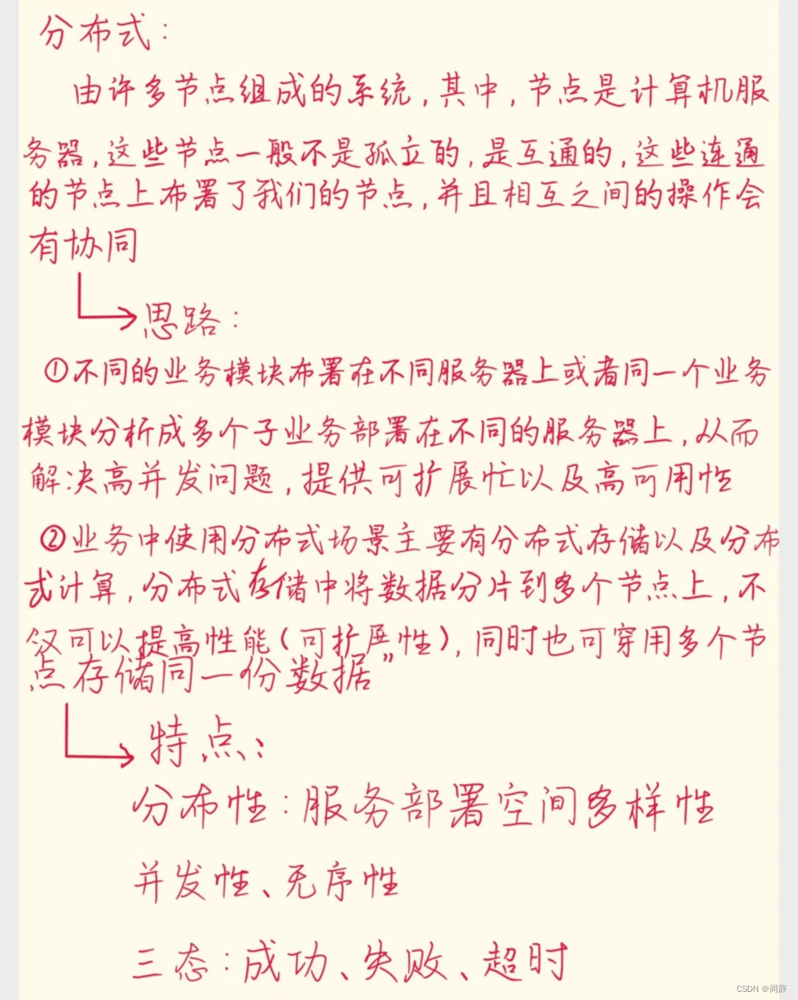
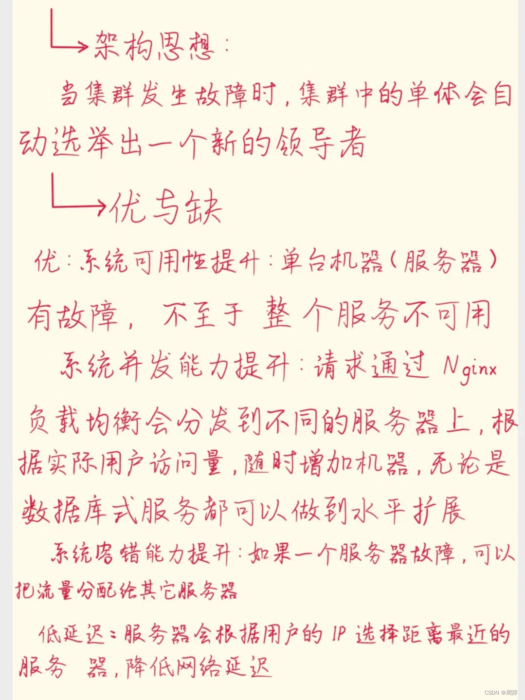
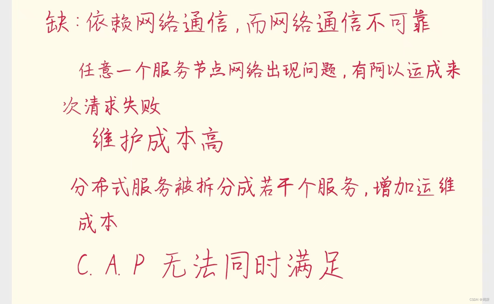
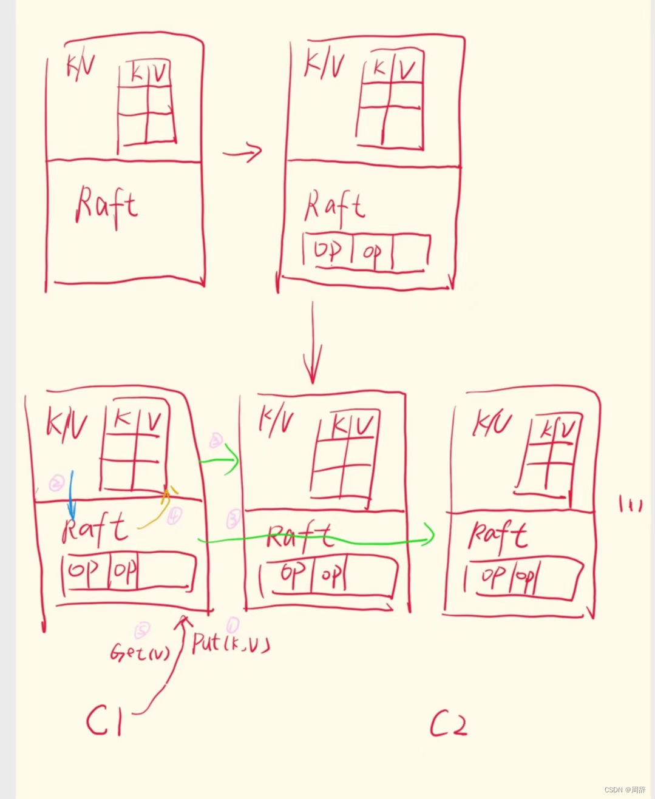

# mit 6.824 分布式系统/Raft一致性算法学习（1）
## 前言：
分布式系统应用在很多现实生活中系统，例如大型网站通常是由大量的计算机构成的分布式系统来运行。分布式系统还是一种学术上的好奇尝试，人们只是发现有时需要一些小规模的系统，并且预感在未来这（大规模分布式系统）可能很重要。但是现在，随着大型网站的兴起和推动，出现了大量的数据和大型数据中心。在过去的二十年中，分布式系统已经是计算架构中很重要的一部分。这意味着大量的精力投入到解决相关问题的工作中，但是同样有少数问题还没有被解决。
`提示：以下是本篇文章正文内容，下面案例可供参考`

## 一、 脑裂（Split Brain）
### 定义
脑裂（Split Brain）是分布式系统中的一个术语，指的是由于网络分区（Network Partition）导致集群被分割成两个或多个互不通信的子集群，每个子集群都认为自己是完整的集群并尝试独立进行操作。这种情况可能会导致==数据不一致、服务冲突==等严重问题。
### 出现情况
脑裂问题主要由==网络问题==引起，例如网络故障或网络延迟，导致集群的一部分节点无法与其他节点通信。脑裂可能会导致数据不一致，因为不同的子集群可能会独立处理请求，导致==不同副本之间的数据出现不一致==。此外，还可能发生服务冲突，如果两个子集群都尝试执行相同的服务或任务，可能会导致冲突或重复处理。

在多副本系统（replication system）中，需要一个单节点来决定，在多个副本中，谁是主（Primary）。使用一个单节点的好处是，它不可能否认自己。因为只有一个节点，它的决策就是整体的决策。但是使用单节点的缺点是，它本身又是一个单点故障（Single Point of Failure）。

这个单点，会在系统出现局部故障时，选择数据的主拷贝来继续工作。使用单点的原因是，我们需要避免脑裂（Split-Brain）。当出现故障时，我们之所以要极其小心的决定数据的主拷贝，是因为，如果不这么做的话，我们可能需要面临脑裂的场景。

## 二、过半票决（Majority Vote）
### 前言
尽管存在脑裂的可能，但是随着技术的发展，人们发现哪怕网络可能出现故障，可能出现分区，实际上是可以正确的实现能够自动完成故障切换的系统。当网络出现故障，将网络分割成两半，网络的两边独自运行，且不能访问对方，这通常被称为==网络分区==。

在构建能自动恢复，同时又避免脑裂的多副本系统时，人们发现，关键点在于过半票决（Majority Vote）。这是Raft论文中出现的，用来构建Raft的一个基本概念。过半票决系统的第一步在于，服务器的==数量要是奇数==，而不是偶数。如果是偶数，当中间出现故障，那两边就太过对称了。这里被网络故障分隔的两边，它们看起来完全是一样的，它们运行了同样的软件，所以它们也会做相同的事情，这样不太好会导致脑裂。

这里背后的逻辑是，如果网络存在分区，那么必然不可能有超过一个分区拥有过半数量的服务器。==如果系统有 2 * F + 1 个服务器，那么系统最多可以接受F个服务器出现故障，仍然可以正常工作。==

### 原理
**节点投票**：在分布式系统中，每个节点或进程都可以参与投票。在某些系统中，节点可能具有不同的权重，但在基本的过半票决中，每个节点的投票权重通常是相同的。

**达成共识**：为了使提案或决策生效，必须获得超过一半的投票支持。这意味着如果有N个节点，提案需要获得至少N/2 + 1的票数才能通过。

**处理平票**：在某些情况下，投票可能会出现平票，即没有一方获得过半数支持。这时，系统可能需要重新投票或采取其他措施来打破僵局。

### 应用场景

**领导者选举**：在主从架构的分布式系统中，过半票决可以用来选举领导者（Leader）。实际上，相比其他特性，Raft更依赖这个特性来避免脑裂。例如，在ZooKeeper或Kafka中，集群中的节点会通过投票来选举出一个领导者，负责协调和管理集群状态。当一个Raft Leader竞选成功，那么这个Leader必然凑够了过半服务器的选票，而这组过半服务器中，必然与旧Leader的过半服务器有重叠。所以，新的Leader必然知道旧Leader使用的==任期号（term number）==，因为新Leader的过半服务器必然与旧Leader的过半服务器有重叠，而旧Leader的过半服务器中的每一个必然都知道旧Leader的任期号。类似的，任何旧Leader提交的操作，必然存在于过半的Raft服务器中，而任何新Leader的过半服务器中，必然有至少一个服务器包含了旧Leader的所有操作。这是Raft能正确运行的一个重要因素。

**数据一致性**：在分布式数据库或存储系统中，过半票决可以确保数据的一致性。例如，当更新数据时，需要过半数的副本确认更新操作，以确保数据的最终一致性。

**配置变更**：在需要变更系统配置时，过半票决可以用来确保变更得到集群中大多数节点的同意，从而避免配置不一致的问题。

## 三、Raft 初探

### 浅谈
Raft会以库（Library）的形式存在于服务中。如果你有一个基于Raft的多副本服务，那么每个服务的副本将会由两部分组成：应用程序代码和Raft库。应用程序代码接收RPC或者其他客户端请求；不同节点的Raft库之间相互合作，来维护多副本之间的操作同步。
### 整体流程
从软件的角度来看一个Raft节点，我们可以认为在该节点的上层，是应用程序代码。例如对于Lab 3来说，这部分应用程序代码就是一个Key-Value数据库。应用程序通常都有状态，Raft层会帮助应用程序将其状态拷贝到其他副本节点。对于一个Key-Value数据库而言，对应的状态就是Key-Value Table。应用程序往下，就是Raft层。所以，Key-Value数据库需要对Raft层进行函数调用，来传递自己的状态和Raft反馈的信息。
  
Raft本身也会保持状态。对我们而言，Raft的状态中，最重要的就是Raft会记录操作的日志。想情况下，也会有完全相同的数据分别存在于两层（应用程序层和Raft层）中。除此之外，还有一些客户端，假设我们有了客户端1（C1），客户端2（C2）等等。

客户端会将请求发送给当前Raft集群中的Leader节点对应的应用程序。这里的请求就是应用程序级别的请求，例如一个访问Key-Value数据库的请求。这些请求可能是Put也可能是Get。Put请求带了一个Key和一个Value，将会更新Key-Value数据库中，Key对应的Value；而Get向当前服务请求某个Key对应的Value。之后，Raft节点之间相互交互，直到过半的Raft节点将这个新的操作加入到它们的日志中，也就是说这个操作被过半的Raft节点复制了。Raft的Leader节点中的Raft层，会向上发送一个通知到应用程序，也就是Key-Value数据库，来说明：刚刚你提交给我的操作，我已经提交给过半节点副本，并且已经成功拷贝给它们了，现在，你可以真正的执行这个操作了。

所以，客户端发送请求给Key-Value数据库，这个请求不会立即被执行，因为这个请求还没有被拷贝。当且仅当这个请求存在于过半的副本节点中时，Raft才会通知Leader节点，只有在这个时候，Leader才会实际的执行这个请求。对于Put请求来说，就是更新Value，对于Get请求来说，就是读取Value。最终，请求返回给客户端，这就是一个普通请求的处理过程。

**下面是我的笔记**

**值得注意的是：**
当一个操作最终在Leader节点被提交之后，每个副本节点的Raft层会将相同的操作提交到本地的应用程序层。在本地的应用程序层，会将这个操作更新到自己的状态。所以，理想情况是，所有的副本都将看到相同的操作序列，这些操作序列以相同的顺序出现在Raft到应用程序的upcall中，之后它们以相同的顺序被本地应用程序应用到本地的状态中。假设操作是确定的（比如一个随机数生成操作就不是确定的），所有副本节点的状态，最终将会是完全一样的。我们图中的Key-Value数据库，就是Raft论文中说的状态（也就是Key-Value数据库的多个副本最终会保持一致）
## 四、小结
以上是Raft一致性算法致力于分布式系统的大体流程，我认为最精彩的点就是过半票决，感觉正是由于这种思想让Raft一致性算法“大厦”构建起来，同时也是分布式系统中确保一致性和高可用性的关键机制之一。