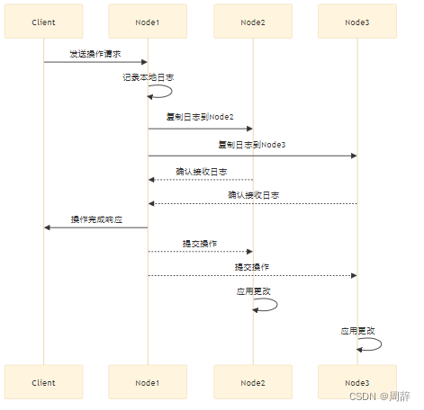

# mit 6.824 分布式系统/Raft一致性算法学习（2）
## 前言

`提示：自己笔记上记录的大概内容：`

## 一、Log 同步时序

  ### 1.1 概念：
       
  &nbsp;&nbsp;&nbsp;&nbsp;&nbsp;&nbsp;&nbsp;&nbsp;在分布式系统中，日志同步是一个关键的组件，用于确保系统的一致性和容错性。日志同步通常涉及到多个节点之间的信息交换，以确保每个节点的状态是一致的。

  ###  1.2执行步骤
  
&nbsp;&nbsp;&nbsp;&nbsp;&nbsp;&nbsp;&nbsp;&nbsp;1.客户端请求：客户端向分布式系统中的主节点（或领导者）发送操作请求。

&nbsp;&nbsp;&nbsp;&nbsp;&nbsp;&nbsp;&nbsp;&nbsp;2.日志记录：主节点接收到请求后，首先将操作记录到自己的本地日志中。
这个日志条目通常包括操作的类型、时间戳、操作数据以及一个唯一的日志索引。

&nbsp;&nbsp;&nbsp;&nbsp;&nbsp;&nbsp;&nbsp;&nbsp;3.日志复制：主节点将这个添加日志（AppendEntries）复制到其他节点（称为跟随者或副本）。复制可以是同步的，也可以是异步的，这取决于系统的设计。
     == 服务器1会一直等待其他副本节点的响应，一直等到过半节点的响应返回。这里的过半节点包括Leader自己。==

&nbsp;&nbsp;&nbsp;&nbsp;&nbsp;&nbsp;&nbsp;&nbsp;4.日志确认：在同步复制中，主节点等待所有跟随者确认==过半节点==已经接收并存储了日志条目（上面图只需要除节点1以外，任意一个节点确定即可）；在异步复制中，主节点可能不需要等待所有跟随者的确认，而是继续处理其他请求。

&nbsp;&nbsp;&nbsp;&nbsp;&nbsp;&nbsp;&nbsp;&nbsp;5.提交操作：当所有必要的跟随者确认了日志条目（在同步复制中），或者当满足特定的条件（在异步复制中），主节点将日志条目标记为“提交”。主节点随后执行日志条目中描述的操作。

&nbsp;&nbsp;&nbsp;&nbsp;&nbsp;&nbsp;&nbsp;&nbsp;6.应用更改：主节点将操作的结果应用到自己的状态机中。跟随者在接收到已提交的日志条目后，也会执行相应的操作并更新自己的状态。

&nbsp;&nbsp;&nbsp;&nbsp;&nbsp;&nbsp;&nbsp;&nbsp;7.响应客户端：一旦操作被执行并且状态更新完成，主节点向客户端发送操作成功或失败的响应。

&nbsp;&nbsp;&nbsp;&nbsp;&nbsp;&nbsp;&nbsp;&nbsp;8.故障检测与恢复：如果在日志复制或执行过程中发生故障，系统需要进行故障检测和恢复。这可能涉及到重新选举主节点、重新复制日志条目或从备份中恢复状态。

&nbsp;&nbsp;&nbsp;&nbsp;&nbsp;&nbsp;&nbsp;&nbsp;9.日志压缩：为了优化存储和性能，系统可能会定期压缩日志，删除旧的日志条目或合并多个日志条目。

&nbsp;&nbsp;&nbsp;&nbsp;&nbsp;&nbsp;&nbsp;&nbsp;10.监控与维护：分布式系统需要持续监控日志同步的状态和性能。维护工作可能包括日志清理、性能调优和一致性检查。
   ### 1.3注意点
&nbsp;&nbsp;&nbsp;&nbsp;&nbsp;&nbsp;&nbsp;&nbsp;在日志确认中，这条消息的具体内容依赖于整个系统的状态。至少在Raft中，没有明确的committed消息。相应的，committed消息被夹带在下一个AppendEntries消息中，由Leader下一次的AppendEntries对应的RPC发出。任何情况下，当有了committed消息时，这条消息会填在AppendEntries的==RPC==中。下一次Leader需要发送心跳，或者是收到了一个新的客户端请求，要将这个请求同步给其他副本时，Leader会将新的更大的commit号随着AppendEntries消息发出，当其他副本收到了这个消息，就知道之前的commit号已经被Leader提交，其他副本接下来也会执行相应的请求，更新本地的状态。 

&nbsp;&nbsp;&nbsp;&nbsp;&nbsp;&nbsp;&nbsp;&nbsp;对于这点==Robert教授==认为如果客户端请求很频繁，那就无所谓了。因为如果每秒有1000个请求，那么下一条AppendEntries很快就会发出，你可以在下一条消息中带上新的commit号，而不用生成一条额外的消息。额外的消息代价还是有点高的，反正你要发送别的消息，可以把新的commit号带在别的消息里。

## 二、日志（Raft Log）
`提示：为什么Raft系统这么关注Log，Log究竟起了什么作用？这个问题值得好好来回答一下。`
   ### 2.1 作用

&nbsp;&nbsp;&nbsp;**对于Leader而言:** 用来对操作排序的一种手段，Raft日志确保所有副本（即系统中的节点）对于给定的操作序列达成一致。实际上，Log是一些按照==数字编号的槽位==（类似一个数组），槽位的数字表示了Leader选择的顺序。在这个过程中，要确保该log被过半节点==复制==并存储后，它才被认为是“提交”的。一旦日志条目被提交，领导者会将该条目应用到自己的状态机，并且通知其他副本应用该条目。所有副本不仅要执行相同的操作，还需要用==相同的顺序==执行这些操作。
&nbsp;&nbsp;&nbsp;同时日志==记录了所有客户端发起的操作请求==，包括操作类型、操作数据以及操作的时间戳等信息。如果一些Follower由于网络原因或者其他原因短时间离线了或者丢了一些消息，Leader需要能够向Follower重传丢失的Log消息。所以，Leader也需要一个地方来存放客户端请求的拷贝。即使对那些已经commit的请求，为了能够向丢失了相应操作的副本重传，也需要存储在Leader的Log中。如果一些Follower由于网络原因或者其他原因短时间离线了或者丢了一些消息，Leader需要能够向Follower==重传丢失的Log消息。==

&nbsp;&nbsp;&nbsp;**对于Follower而言:** 如果某个副本落后于其他副本，它可以通过接收领导者的日志来同步状态，确保所有副本的状态一致，从而实现==状态同步==。在节点故障或重启后，Raft日志可以用于恢复节点的状态。通过追赶领导者的日志，副本可以==恢复到故障前的状态==。为了减少存储需求和提高效率，Raft算法会定期进行==日志压缩==，删除旧的日志条目，只保留必要的信息。

&nbsp;&nbsp;&nbsp;**对于领导者选举：** 在Raft算法中，日志也用于领导者选举。候选人（Candidate）在发起选举时，会展示其日志的完整性和最新性，以说服其他副本投票支持它。Follower堆积了10亿（不是具体的数字，指很多很多）Log未执行，最终这里会耗尽内存。之后Follower调用内存分配器为Log申请新的内存时，内存申请会失败。

### 2.1 注意点
&nbsp;&nbsp;&nbsp;&nbsp;&nbsp;&nbsp;&nbsp;&nbsp;假设Leader每秒可以执行1000条操作，Follower只能每秒执行100条操作。Follower在实际执行操作前会确认操作，并将操作堆积在Log中。而Log又是无限的，所以Follower或许可以每秒确认1000个操作。在一个实际的系统中，你需要一个==额外的消息==，这个额外的消息可以夹带在其他消息中，也不必是实时的，Follower会告诉Leader自己已经执行到了哪一步。这样Leader就能知道自己在操作执行上领先太多。**这种方式会让系统达到一个极限性能**
&nbsp;&nbsp;&nbsp;&nbsp;&nbsp;&nbsp;&nbsp;&nbsp;如果Leader和Follower同时故障，它们只有non-volatile状态（也就是==磁盘中存储的状态==）。这里的状态==包括了Log和最近一次任期号（Term Number）==。如果大家都出现了故障然后大家都重启了，它们中没有一个在刚启动的时候就知道它们在故障前执行到了哪一步。所以这个时候，会先进行==Leader选举==，其中一个被选为Leader。**这个Leader会在发送第一次心跳时弄清楚，整个系统中目前执行到了哪一步。Leader会确认一个过半服务器认可的最近的Log执行点，这就是整个系统的执行位置。**
## 三、总结

**这里的计算量或许会非常大。所以这是Raft论文的图2所描述的过程，很明显，这种从头开始执行的机制不是很好，但是这是Raft协议的工作流程。下一课我们会看一种更有效的，利用checkpoint方式。**
