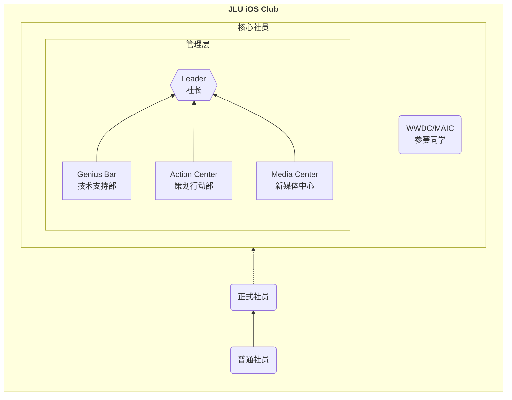

# 加入我们

> 社团纳新火热进行中：[2024 百团纳新](/activities/240414-club-recruitment/)

## 组织架构

JLU iOS Club 原则上设有社长兼负责人 1 名，副社长 2~3 名，并可兼任其中一部门的部长。

社团下设3个部门，分别为**技术支持部**、**策划行动部**、**新媒体中心**，与社长共同组成社团**管理层**，完成社团内外的各项事务。管理层成员连同参赛同学，均为我社**核心成员**，享有更多的关注与资源支持。

非核心社员分为**普通社员**与**正式社员**。普通社员实为编外人员，可以加入社团相关联络组织，获取最新活动咨询、学习资料等，也可以参与社团面向全校的公开活动，但社团方面仅提供最有限的支持，也不能参与任何社团内部活动。正式社员在普通社员的基础上享有更多权益，包括但不限于以下几点：

- 正式社员专有身份证明，每次活动可参与集章，获得特殊奖励；
- 可以参与社团内部的小规模活动，如技术分享会、星光露营、外出团建等；
- 可以获得每年一次的《Swift 应用程序开发 助理级认证》考试资格；
- 与[安诺西校园体验中心](https://www.jluios.club/news/an-nuo-xi/)合作，为社员购买苹果产品提供专享优惠与售后；
- 根据竞赛及其它需求，可酌情提供 Apple 设备借用权；
- 可以参与社团领导层选拔，出席投票选举与换届仪式。

::: details 社团架构示意图 （点击展开）

:::

### 技术支持部 <Badge type="info" text="5~10人" />

技术支持部 是 iOS Club 核心中的核心，整个社团的顶梁柱。我们认为，无论你是熟悉编程，还是擅长美工设计，亦或是善于商业策划，都是闪闪发光的技术人才。只要你有一腔热情，都可以为其他社团成员提供常驻技术支持，并出席线下技术分享活动。iOS Club 也会优先为技术支持部的同学提供各种机会与支持，我们一起取得更辉煌的成就！

**只要你有“一技之长”，对 iOS Club 充满热情，我们都欢迎！**

但限于纳新需要，我们仍然列出了一些技术要求，满足要求的同学优先考虑，但仅供参考：

1. 熟悉或正在学习 Swift & SwiftUI 开发，或了解 App 开发流程的同学；
2. 擅长使用 Photoshop/Sketch/Figma 等设计工具，或有美工功底的同学；
3. 来自商管专业，了解并熟悉商业策划、市场调研的同学；
4. 非常了解 Apple 产品，对其软硬件产品具有独到见解的同学。

### 策划行动部 <Badge type="info" text="3~5人" />

活动是 iOS Club 的灵魂所在。我们通过定期举办活动，提高社团关注度，维持社团活力。在这里，你可以：

- 提出新的活动主题，成为活动主讲人，切身了解主导策划一场活动的过程；
- 参与组织分工，在小组讨论中分享自己的想法，体会团队合作办项目的经历；
- 协调分配社团内外的各项资源，熟悉社团组织运作的整个流程。

了解我们曾经举办过的各项活动：[社团活动](http://www.jluios.club/activities/)

### 新媒体中心 <Badge type="info" text="3~5人" />

目前社团内正在运营的宣传平台有：QQ群、微信公众号、社团网站
 正在考虑筹备上线运营：哔哩哔哩、抖音、小红书

其中，社团网站托管在 [Github](https://github.com/AQiu-2003/JLUiOSClub_Web/)，目前还处于项目前期阶段，亟需熟悉前端开发的同学。此外，新媒体的同学还会参与到活动宣传海报、印刷物料的设计当中，制作各种果味文案😉。

因为我社与安诺希校园体验中心有合作，日常也会写一些推广文案，参与的同学也可以得到一定报酬。

## 成为普通社员

关注我们的公众号，并加入QQ群，获取一手咨询新闻，更多精彩活动等你参加~
 以及… 收藏我们的官网不迷路：[jluios.club](https://www.jluios.club/)

<dualQRCode/>

## 成为正式社员

### 途径1：百团纳新

在每年四月份中旬的**百团纳新**当天，来我们的摊位上参与互动问答，并与我们沟通。经过我们的认证即可正式加入 iOS Club，成为正式社员，享有社员专属权益。

::: tip
百团纳新期间，是 Club 吸纳**核心社员**的最重要环节，我们也更欢迎想要加入**管理层**的同学，在此期间积极加入可获得**更丰富的奖品**！
:::

### 途径2：在线答题

您可以在任意时间参与我们的 [线上答题](https://ks.wjx.top/vm/mbkrxvr.aspx#) 活动（就像b站入站答题那样😉），并留下您的联系方式。经过我们的认证即可正式加入 iOS Club，成为正式社员，享有社员专属福利。
