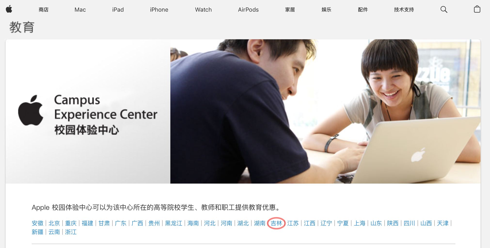
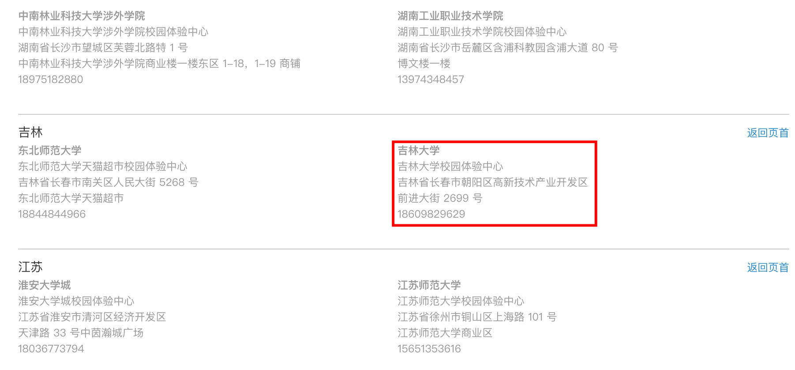

# 🎉 吉大终于也有自己的 Apple 校园体验店啦！

## 安诺希校园体验中心

体验中心内设一展台，包括 iPhone、iPad、Apple Watch、MacBook 等均可现场体验！

<el-carousel indicator-position="none" show-arrow autoplay motion-blur>
  <el-carousel-item>
    <el-image src="https://pic.imgdb.cn/item/66099f909f345e8d0395a4b0.jpg" fit="cover" style="height: 100%; width: 100%"></el-image>
  </el-carousel-item>
  <el-carousel-item>
    <el-image src="https://pic.imgdb.cn/item/66099f909f345e8d0395a59a.jpg" fit="cover" style="height: 100%; width: 100%"></el-image>
  </el-carousel-item>
</el-carousel>

## 营业资质

安诺希校园体验中心是吉林省第二家具有官方资质的校园体验中心，其地址等信息均可在[Apple 校园体验中心](https://www.apple.com.cn/education/how-to-buy/aacs.html#6a)官网查询到。

## 如何前往 安诺希校园体验中心

📍 吉林大学前卫南区 日新楼六楼 外文书店内

::: info 小技巧
从日新楼三号门进入，坐电梯直达六楼～

