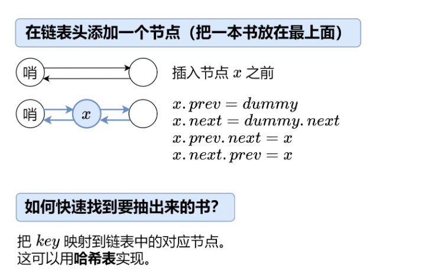

# LRU缓存
## 题目描述：
实现 LRUCache 类：
 1. LRUCache(int capacity) 以 正整数 作为容量 capacity 初始化 LRU 缓存
 2. int get(int key) 如果关键字 key 存在于缓存中，则返回关键字的值，否则返回 -1 。
 3. void put(int key, int value) 如果关键字 key 已经存在，则变更其数据值 value ；如果不存在，则向缓存中插入该组 key-value 。如果插入操作导致关键字数量超过 capacity ，则应该 逐出 最久未使用的关键字。
 4. **函数 get 和 put 必须以 O(1) 的平均时间复杂度运行。**

 ## 问题转换：



## 思路一：
```java
class LRUCache {
    private static class Node {
        int key, value;
        Node prev, next;

        Node(int k, int v) {
            key = k;
            value = v;
        }
    }

    private final int capacity;
    private final Node dummy = new Node(0, 0); // 哨兵节点
    private final Map<Integer, Node> keyToNode = new HashMap<>();

    public LRUCache(int capacity) {
        this.capacity = capacity;
        dummy.prev = dummy;
        dummy.next = dummy;
    }

    public int get(int key) {
        Node node = getNode(key);
        return node != null ? node.value : -1;
    }

    public void put(int key, int value) {
        Node node = getNode(key);
        if (node != null) { // 有这本书
            node.value = value; // 更新 value
            return;
        }
        node = new Node(key, value); // 新书
        keyToNode.put(key, node);
        pushFront(node); // 放在最上面
        if (keyToNode.size() > capacity) { // 书太多了
            Node backNode = dummy.prev;
            keyToNode.remove(backNode.key);
            remove(backNode); // 去掉最后一本书
        }
    }

    private Node getNode(int key) {
        if (!keyToNode.containsKey(key)) { // 没有这本书
            return null;
        }
        Node node = keyToNode.get(key); // 有这本书
        remove(node); // 把这本书抽出来
        pushFront(node); // 放在最上面
        return node;
    }

    // 删除一个节点（抽出一本书）
    private void remove(Node x) {
        x.prev.next = x.next;
        x.next.prev = x.prev;
    }

    // 在链表头添加一个节点（把一本书放在最上面）
    private void pushFront(Node x) {
        x.prev = dummy;
        x.next = dummy.next;
        x.prev.next = x;
        x.next.prev = x;
    }
}
```
## 思路二：
```java
class LRUCache {
    private final int capacity;
    private final Map<Integer, Integer> cache = new LinkedHashMap<>(); // 自带双向链表

    public LRUCache(int capacity) {
        this.capacity = capacity;
    }

    public int get(int key) {
        // 删除 key，并利用返回值判断 key 是否在 cache 中
        Integer value = cache.remove(key);
        if (value != null) { // key 在 cache 中
            cache.put(key, value); // 把 key 移到链表末尾
            return value;
        }
        // key 不在 cache 中
        return -1;
    }

    public void put(int key, int value) {
        // 删除 key，并利用返回值判断 key 是否在 cache 中
        if (cache.remove(key) != null) { // key 在 cache 中
            cache.put(key, value); // 把 key 移到链表末尾
            return;
        }
        // key 不在 cache 中，那么就把 key 插入 cache，插入前判断 cache 是否满了
        if (cache.size() == capacity) { // cache 满了
            Integer oldestKey = cache.keySet().iterator().next();
            cache.remove(oldestKey); // 移除最久未使用 key
        }
        cache.put(key, value);
    }
}
```

## 思路三：
```java
class LRUCache extends LinkedHashMap<Integer, Integer> {
    private static final float DEFAULT_LOAD_FACTOR = 0.75f;
    private final int capacity;

    public LRUCache(int capacity) {
        super(capacity, DEFAULT_LOAD_FACTOR, true);
        /*设置初始容量、加载因子，并设置 accessOrder 为 true，
        这使得 LinkedHashMap 按照访问顺序来排序项。
        如果设置了 accessOrder 为 true，则 LinkedHashMap会转变为一个按照访问顺序来排序的映射，
        最近访问的项在头部，最老访问的项在尾部。*/
        this.capacity = capacity;
    }
    

    //功能：获取键对应的值。
    public int get(int key) {
        return super.getOrDefault(key, -1);
    }


    //功能：决定是否移除最老的条目
    @Override
    protected boolean removeEldestEntry(Map.Entry<Integer, Integer> eldest) {
        return size() > capacity;
    }
}
```