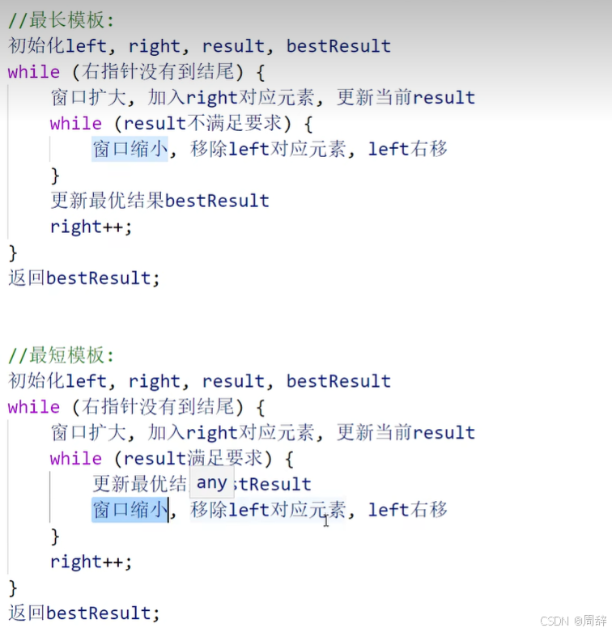

# 题目 无重复字符的最长字串：
`地址 ：https://leetcode.cn/problems/longest-substring-without-repeating-characters/description/`
## 问题描述

给定一个字符串 s ，请你找出其中不含有重复字符的 最长 
子串。

**代码：**
---

```java
public String longestStrings(String s) {
        Map<Character, Integer> map = new HashMap<>();
        int maxLength = 0; // 不含重复字符的最长子字符串长度
        int start = 0; // 滑动窗口的起始位置
        String longestSubstring = ""; // 存储最长子字符串

        for (int end = 0; end < s.length(); end++) {
            char currentChar = s.charAt(end);
            if (map.containsKey(currentChar)) {
                // 如果字符已存在，移动start指针到重复字符的下一个位置
                start = Math.max(start, map.get(currentChar) + 1);
            }
            // 更新字符的索引
            map.put(currentChar, end);
            // 检查当前子字符串是否是最长的
            if (end - start + 1 > maxLength) {
                maxLength = end - start + 1;
                longestSubstring = s.substring(start, end + 1);
            }
        }

        return longestSubstring;
    }
```

## 思路：

通过使用滑动窗口的方法来解决。滑动窗口可以用双指针表示，一个指针表示子串的开始位置，另一个指针表示结束位置。当我们移动结束位置的指针来扩展窗口时，如果遇到了重复字符，就移动开始位置的指针来缩小窗口，直到子串中不再包含重复字符为止。

---

## 代码分析：

`本质上其实是滑动窗口算法的应用，在边界条件的处理上，我的理解是右指针相当于在前面探索，直到走完全部，在这个过程中如果遇到不满足条件的，要靠左指针向右指针不断靠近去确保范围的准确性`同时更新最优结果。



